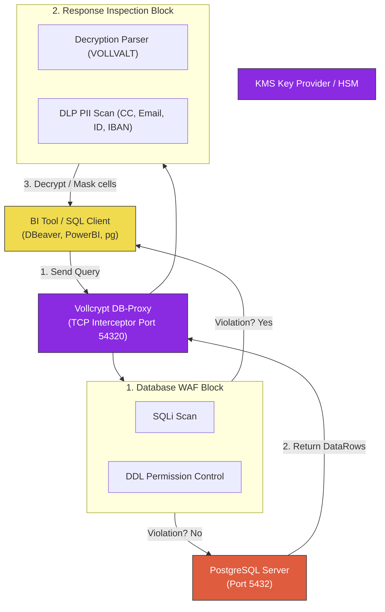

# db-proxy

A zero-trust, wire-protocol database cryptographic gateway for PostgreSQL. It transparently intercepts query response streams to decrypt and mask encrypted database fields on-the-fly, allowing off-the-shelf BI tools (DBeaver, PowerBI, Tableau) and application clients to access encrypted data securely without modifying database engine logic.

`db-proxy` works in conjunction with `@vollcrypt/db-guard` to enforce field-level security, role-based access control (RBAC), and decryption rate limits at the network layer.

---

## Key Features

- **Protocol-Level Interception**: Intercepts PostgreSQL v3.0 wire traffic to inspect backend `DataRow` packets without parsing or modifying complex SQL command dialects.
- **SSL/TLS Fallback Negotiation**: Auto-refuses database client `SSLRequest` frames by responding with standard protocol fallback indicators, forcing clients to establish unencrypted TCP connections to the local proxy. This eliminates local certificate management overhead.
- **Advanced Database Firewall (Database WAF & SQLi Protection)**: Scans incoming query packets ('Q' Simple Queries and 'P' Parse Extended Queries) to block SQL Injection signatures and unauthorized DDL operations (DROP, TRUNCATE, ALTER) based on the client's role.
- **Dynamic Data Loss Prevention (DLP)**: Scans raw, unencrypted database cell responses for PII formats (Credit Cards, Emails, National IDs, and IBANs) and automatically applies masking filters in transit.
- **SQL Query Rewriting & Dynamic Masking**: Transparently rewrites SQL queries to inject database-level masking expressions (e.g. replacing sensitive columns with custom string concat and extraction filters) depending on the user's role.
- **Automatic Row-Level Security (RLS) Tenant Isolation**: Automatically appends or injects tenant isolation clauses (e.g. `WHERE tenant_id = 'org_xxx'`) into SQL statements executed by tenant-scoped database users.
- **Behavioral Anomaly Detection & Throttling**: Monitors query-to-row egress volume ratios per connection using a rolling 10-second window. Triggers alerts and injects non-blocking execution delays (50ms/row) to prevent mass data exfiltration if the limit (>100 rows) is exceeded.
- **Differential Privacy (Laplace Noise Injection)**: Automatically injects mathematically calibrated Laplace noise into numeric database aggregate cells (columns beginning with `avg`, `sum`, or `count`) to prevent inference attacks.
- **SIEM / Syslog Integration**: Logs WAF violations, behavioral anomalies, rate limit crossings, and JIT access modifications in standardized Common Event Format (CEF) directly to `logs/siem.cef`.
- **Cryptographic Access Control**: Translates query-time column metadata (`RowDescription` packets) to match column tags against RBAC permissions.
- **PostgreSQL Error Frame Mapping**: Generates authentic PostgreSQL error packets (code `42501` - Insufficient Privilege) when an unauthorized client requests columns they are not permitted to decrypt or performs forbidden SQL commands.
- **Fail-Closed Protection**: Shuts down decryption, zeroizes keys in memory, and blocks subsequent queries if the decryption rate limit or access violation threshold is crossed.

---

## Architecture



---

## Configuration & Usage

Start the proxy server using the built-in CLI:

```bash
vollcrypt-db-proxy --port 54320 --db-host 127.0.0.1 --db-port 5432 --config config.json
```

### Configuration Options

The proxy is configured via a JSON configuration file (`config.json`). This file defines the database username-to-role mappings, RBAC permissions, masking filters, decryption keys, and security rate limits.

#### Configuration Example (`config.json`):

```json
{
  "key": "0101010101010101010101010101010101010101010101010101010101010101",
  "users": {
    "postgres": { "role": "OWNER", "userId": "usr-admin" },
    "analyst_hr": { "role": "HR_ADMIN", "userId": "usr-hr-01" },
    "analyst_marketing": { "role": "MARKETING", "userId": "usr-mkt-01" }
  },
  "cryptoRbac": {
    "roles": {
      "OWNER": {
        "decrypt": ["users.email", "users.tc_no", "users.credit_card"]
      },
      "HR_ADMIN": {
        "decrypt": ["users.email", "users.tc_no"],
        "mask": {
          "users.credit_card": "credit_card"
        }
      },
      "MARKETING": {
        "decrypt": ["users.email"],
        "mask": {
          "users.tc_no": "tc_no",
          "users.credit_card": "credit_card"
        }
      }
    }
  },
  "rateLimiter": {
    "maxDecryptionsPerSecond": 100,
    "mode": "fail_closed"
  },
  "firewall": {
    "ipBanning": {
      "enabled": true
    }
  }
}
```

### Advanced Server Options (CLI / Programmatic)

When deploying multiple proxy nodes, configuring hybrid startups, or securing the cryptographic boundaries, the proxy accepts the following parameters:
- `minResponseTimeMs`: The target constant round-trip duration (in ms) for query executions and WAF block events to mitigate timing attack side-channels. Defaults to `15` ms.
- `gossipPort`: TCP port used for clustering peer-to-peer state synchronization and IP bans gossip.
- `peers`: An array of peer address strings (`host:port`) representing nodes in the consensus cluster.
- `--interactive` / `-i`: Direct launch of the interactive feature configuration menu.
- `--non-interactive` / `-y` / `--yes` / `-n`: Bypass the hybrid countdown startup sequence to launch instantly.
- `--fips` / `--no-fips`: Force FIPS 140-3 cryptographic boundary mode (enables strict validated algorithms and audits).
- `--jit` / `--no-jit`: Toggle Just-In-Time access approval webhook checking for restricted column queries.
- `--anomaly` / `--no-anomaly`: Toggle real-time AI Semantic Anomaly Engine threat checking.
- `--db-type <type>`: Target database protocol driver. Options are `postgres`, `mysql`, or `mongodb`. Defaults to `postgres`.

---

## Dynamic Role Mapping & Masking Behavior

When a SQL client connects to the proxy, the proxy parses the connection parameters:

1. **Connection Username**: Resolved to a role context (e.g. connecting as `analyst_hr` maps to the `HR_ADMIN` role, or `tenant_user` maps to a specific `tenantId`).
2. **Query Validation & Rewriting (WAF)**:
   - If SQL Injection signatures are found (e.g. `' OR 1=1`), the query is aborted.
   - If DDL operations (e.g. `DROP TABLE`) are run by a non-`OWNER` role, the query is aborted.
   - If a tenant ID is associated with the active user context, the proxy automatically injects a tenant isolation condition (e.g. appending `WHERE tenant_id = 'org_xxx'`) to isolate database records at the proxy layer.
   - If a role configuration includes SQL-level masking rules, columns queried by the client are automatically substituted with database-level masking expressions (such as replacing `credit_card` with `'XXXX-XXXX-XXXX-' || right(credit_card, 4)`) before transmission to the database.
   - An ErrorResponse packet is sent to the client socket if a violation is caught, and the incident is logged in Common Event Format (CEF) to `logs/siem.cef`.
3. **Response Inspection (DLP, Decryption & Aggregate Noise)**: 
   - A query returning columns starting with the ciphertext header `VOLLVALT:` is scanned.
     - If the role is authorized to decrypt the column, the proxy returns the plaintext cell.
     - If the role is unauthorized but has a masking rule, the proxy returns the masked cell.
     - If the role is unauthorized and no masking rule is defined, the query aborts immediately. The proxy sends a native PostgreSQL error packet (`42501` - Insufficient Privilege) back to the client.
   - Numeric aggregate values (columns beginning with `avg`, `sum`, or `count`) are subjected to Differential Privacy checks, which inject mathematically calibrated Laplace noise to safeguard against statistical inference attacks.
   - Raw columns (without `VOLLVALT:` prefix) are scanned by the DLP engine. If a cell matches Credit Cards, Emails, National IDs, or IBAN formats, it is dynamically masked before transmission.
4. **Behavioral Egress Rate Limiting**:
   - The proxy tracks the rate of egress rows per connection in a rolling 10-second window.
   - If row egress exceeds 100 rows, a `ANOMALY_DETECTED` security log is written in CEF format, and the proxy injects a 50ms per-row delay to restrict bulk database scraping.

---

## Build from Source

Navigate to the `db-proxy` folder and build the package:

```bash
cd db-proxy
npm install
npm run build
```

Run the integration tests:

```bash
npm test
```

---

## Enterprise Features Roadmap

### 1. Post-Quantum mTLS Termination
Implement custom hybrid mTLS handshakes (Ed25519 + ML-DSA-65) for client-to-proxy certificate authentication, cryptographically preventing unauthorized machines from establishing TCP connections to the gateway.

### 2. Cryptographic Connection Pooling
Multiplex client connections into a persistent backend pool to reduce database connection allocation costs, and cache KMS key handshakes locally in memory within the secure cache wrapper.

---

## Licensing

`db-proxy` is dual-licensed under:
- **Open Source:** GNU General Public License v3.0 ([LICENSE-GPL](LICENSE-GPL))
- **Commercial:** Vollcrypt Commercial License ([LICENSE-COMMERCIAL.md](LICENSE-COMMERCIAL.md))

For licensing details or commercial purchases, please contact [berat.vural.tr@gmail.com](mailto:berat.vural.tr@gmail.com).
