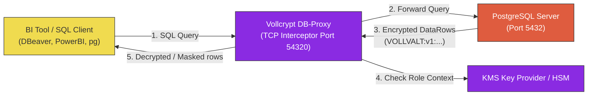

# db-proxy

A zero-trust, wire-protocol database cryptographic gateway for PostgreSQL. It transparently intercepts query response streams to decrypt and mask encrypted database fields on-the-fly, allowing off-the-shelf BI tools (DBeaver, PowerBI, Tableau) and application clients to access encrypted data securely without modifying database engine logic.

`db-proxy` works in conjunction with `@vollcrypt/db-guard` to enforce field-level security, role-based access control (RBAC), and decryption rate limits at the network layer.

---

## Key Features

- **Protocol-Level Interception**: Intercepts PostgreSQL v3.0 wire traffic to inspect backend `DataRow` packets without parsing or modifying complex SQL command dialects.
- **SSL/TLS Fallback Negotiation**: Auto-refuses database client `SSLRequest` frames by responding with standard protocol fallback indicators, forcing clients to establish unencrypted TCP connections to the local proxy. This eliminates local certificate management overhead.
- **Dynamic Data Masking (DDM)**: Integrates DDM rules (email, credit card, national ID masking) from `@vollcrypt/db-guard` based on the active connection user.
- **Cryptographic Access Control**: Translates query-time column metadata (`RowDescription` packets) to match column tags against RBAC permissions.
- **PostgreSQL Error Frame Mapping**: Generates authentic PostgreSQL error packets (code `42501` - Insufficient Privilege) when an unauthorized client requests columns they are not permitted to decrypt.
- **Fail-Closed Protection**: Shuts down decryption, zeroizes keys in memory, and blocks subsequent queries if the decryption rate limit or access violation threshold is crossed.

---

## Architecture



---

## Installation

Install globally or as a project dependency:

```bash
npm install -g @vollcrypt/db-proxy
```

---

## Configuration & Usage

Start the proxy server using the built-in CLI:

```bash
vollcrypt-db-proxy --port 54320 --db-host 127.0.0.1 --db-port 5432 --config config.json
```

### Configuration Options

The proxy is configured via a JSON configuration file (`config.json`). This file defines the database username-to-role mappings, RBAC permissions, masking filters, decryption keys, and security rate limits.

#### Configuration Example (`config.json`):

```json
{
  "key": "0101010101010101010101010101010101010101010101010101010101010101",
  "users": {
    "postgres": { "role": "OWNER", "userId": "usr-admin" },
    "analyst_hr": { "role": "HR_ADMIN", "userId": "usr-hr-01" },
    "analyst_marketing": { "role": "MARKETING", "userId": "usr-mkt-01" }
  },
  "cryptoRbac": {
    "roles": {
      "OWNER": {
        "decrypt": ["users.email", "users.tc_no", "users.credit_card"]
      },
      "HR_ADMIN": {
        "decrypt": ["users.email", "users.tc_no"],
        "mask": {
          "users.credit_card": "credit_card"
        }
      },
      "MARKETING": {
        "decrypt": ["users.email"],
        "mask": {
          "users.tc_no": "tc_no",
          "users.credit_card": "credit_card"
        }
      }
    }
  },
  "rateLimiter": {
    "maxDecryptionsPerSecond": 100,
    "mode": "fail_closed"
  }
}
```

---

## Dynamic Role Mapping & Masking Behavior

When a SQL client connects to the proxy, the proxy parses the connection parameters:

1. **Connection Username**: Resolved to a role context (e.g. connecting as `analyst_hr` maps to the `HR_ADMIN` role).
2. **Column Inspection**: 
   - A query returning columns starting with the ciphertext header `VOLLVALT:` is scanned.
   - If the role is authorized to decrypt the column, the proxy returns the plaintext cell.
   - If the role is unauthorized but has a masking rule, the proxy returns the masked cell (e.g. `1111-XXXX-XXXX-4444` for card numbers, `123XXXXXX89` for national ID numbers).
   - If the role is unauthorized and no masking rule is defined, the query aborts immediately. The proxy sends a native PostgreSQL error frame (`42501` - Insufficient Privilege) back to the client, preventing unauthorized data views.

---

## Build from Source

Navigate to the `db-proxy` folder and build the package:

```bash
cd db-proxy
npm install
npm run build
```

Run the integration tests:

```bash
npm test
```

---

## Licensing

`db-proxy` is dual-licensed under:
- **Open Source:** GNU General Public License v3.0 ([LICENSE-GPL](LICENSE-GPL))
- **Commercial:** Vollcrypt Commercial License ([LICENSE-COMMERCIAL.md](LICENSE-COMMERCIAL.md))

For licensing details or commercial purchases, please contact [berat.vural.tr@gmail.com](mailto:berat.vural.tr@gmail.com).
