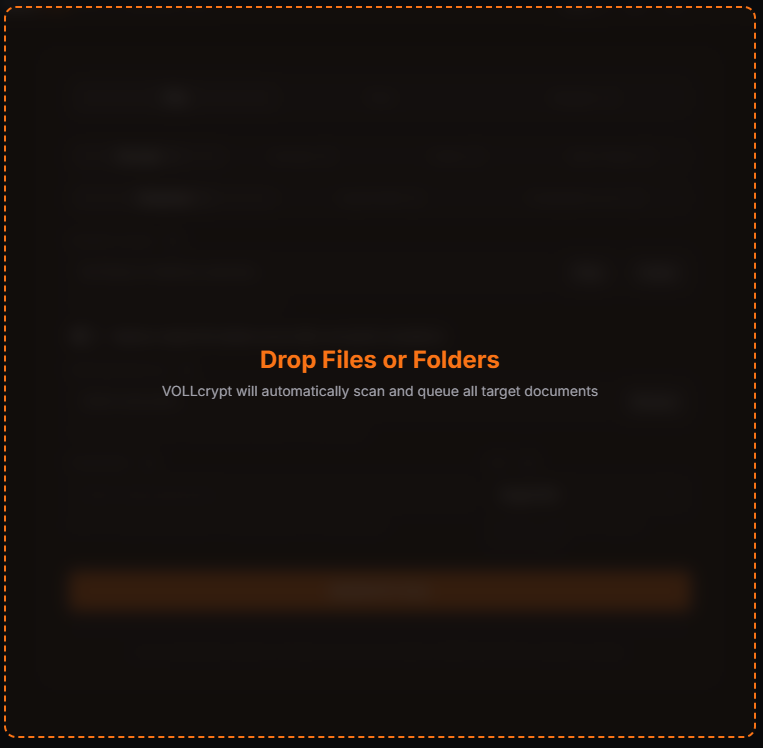
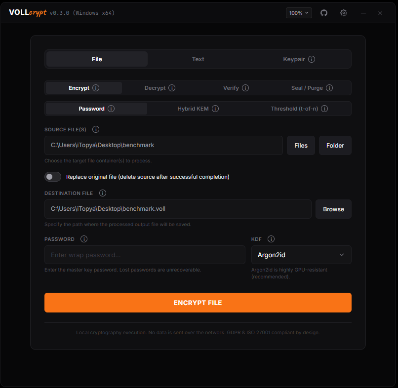
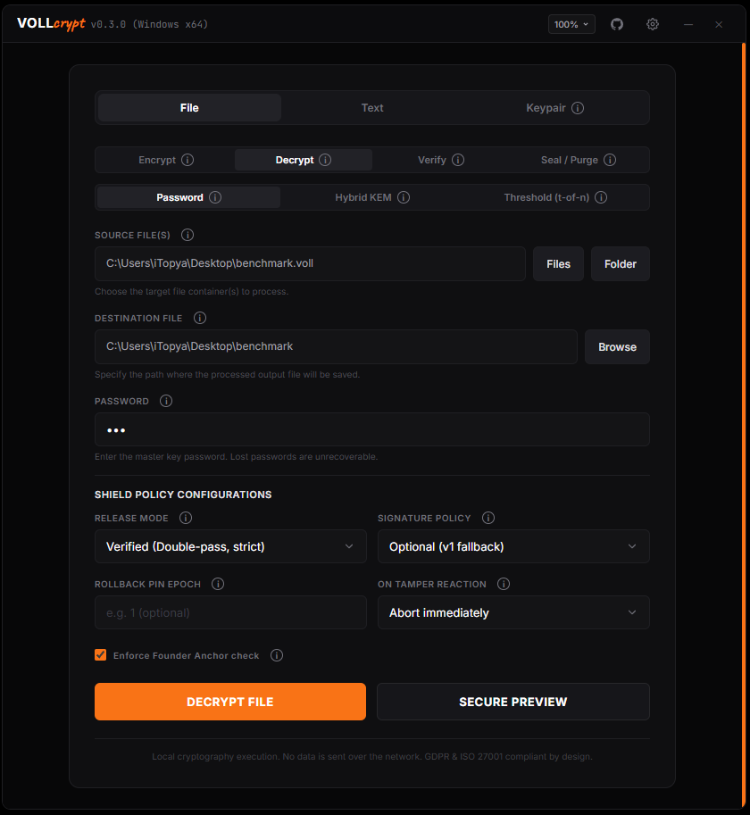
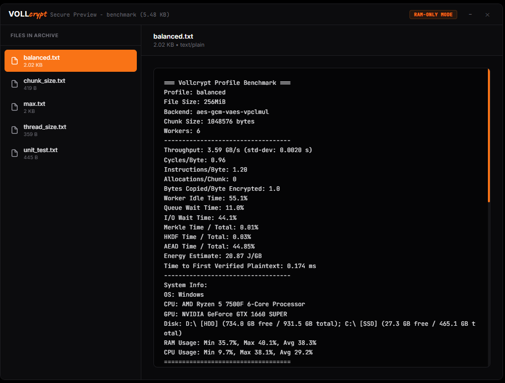
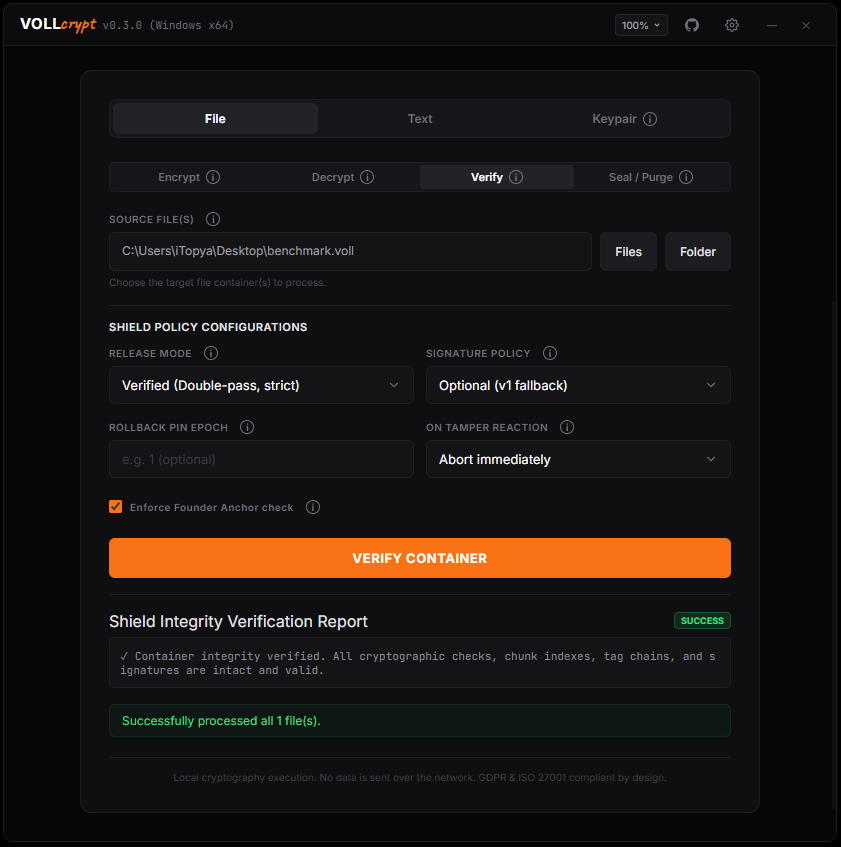
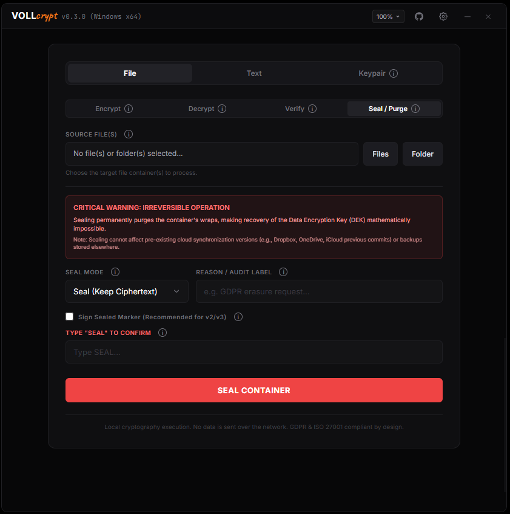
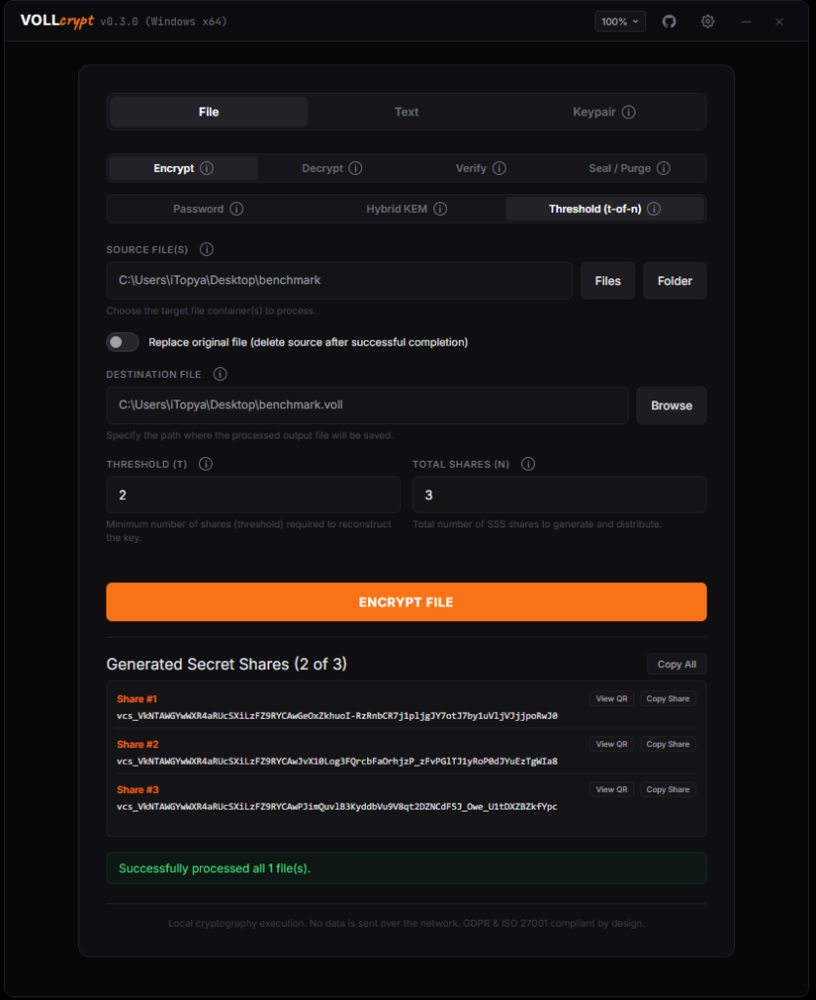
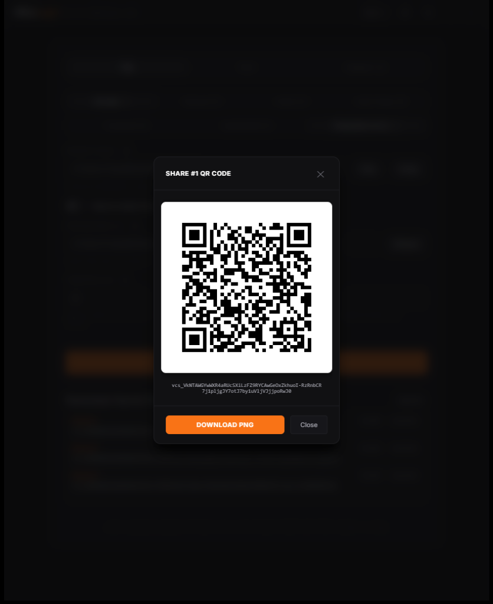
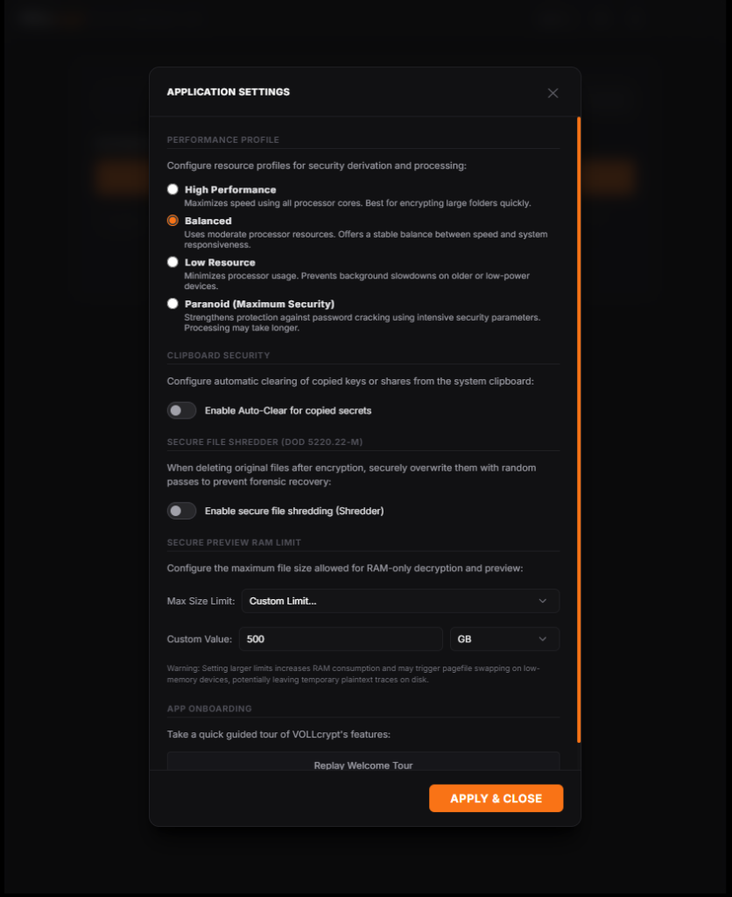
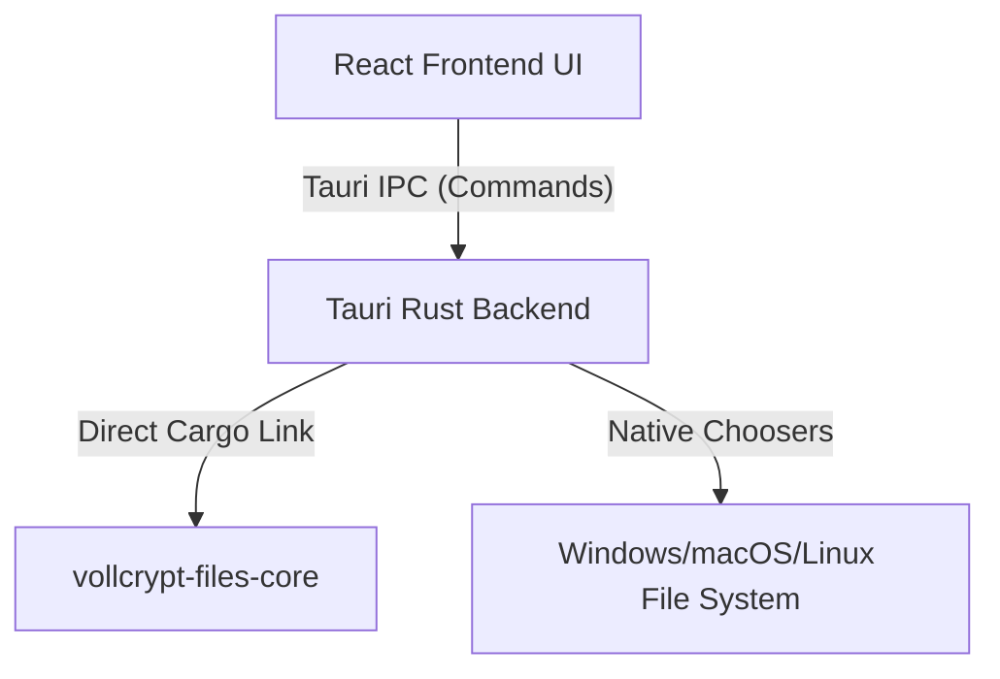

# Vollcrypt Desktop App Module Documentation

**Frameless, dark-mode native desktop application for high-performance local file and text cryptography, built with Tauri (Rust) and React + TypeScript + Vanilla CSS.**


---

## Interface Showcase

Here is a visual walkthrough of the Vollcrypt Desktop application interface:

### 1. Main Cryptography Card & Drag-and-Drop Ingestion
The application features a modern, frameless, dark-mode window with custom titlebar controls and intuitive drag-and-drop file imports.


*Drag-and-drop overlay displaying the glassmorphic state when hovering files over the window.*


*File encryption panel with a selected folder path queued, Argon2id KDF configuration, and password field.*

### 2. Advanced Security Configurations & Decryption
In the Decrypt panel, users can configure release modes, signature verification policies, rollback pin epochs, and launch RAM-only previews.


*File decryption workspace displaying advanced Shield Policy Configurations and the Secure Preview launcher.*

### 3. Secure Preview (RAM-Only Mode)
The secure preview mode decrypts containers entirely in RAM to allow browsing folder structures and reviewing text files without writing plaintext data to disk.


*In-memory secure preview rendering benchmark files and system performance metrics.*

### 4. Container Verification & Sovereign Sealing
Audit container signatures and tag integrity, or perform GDPR-compliant erasure/crypto-shredding operations.


*Successful Shield Integrity Verification Report confirming valid signatures and tag chains.*


*Irreversible Sealing workspace showing critical warnings and the Type-to-Confirm security input.*

### 5. Shamir's Secret Sharing (Threshold Key-Splitting)
Split container keys into n shares and reconstruct the original key using a threshold t of SSS shares, featuring offline QR code export and offline drag-and-drop QR scanning.


*Secret shares generated with copyable strings, offline QR Code views, and individual share copy buttons.*


*Offline QR Code pop-up showing the share vector and PNG download button.*

### 6. Preferences & Performance Tuning
Configure performance profiles (High Performance, Balanced, Low Resource, Paranoid), clear clipboard history, and manage secure preview memory constraints.


*Preferences modal exposing file shredder controls and custom memory-limit dropdown selectors.*

---

## 🏗 Architectural Design

Vollcrypt Desktop is built as a hybrid desktop application utilizing **Tauri v2** for the application runtime and native OS integrations, and **React + Vanilla CSS** for the user interface.



### 1. Tauri Rust Backend (`src-tauri/`)
- Interoperates natively with the [vollcrypt-files-core](file:///c:/Users/iTopya/Desktop/Project/vollcrypt/vollcrypt-files/core) Rust crate.
- Exposes secure native commands to the frontend via Tauri's IPC (Inter-Process Communication) layer.
- Handles multi-threaded cryptographic file operations, native file dialogs, and OS window management safely.

### 2. React + TypeScript Frontend (`src/`)
- Styled using a custom, high-fidelity dark-mode interface with orange highlights.
- Border outlines on Webview click are reset globally (`outline: none !important`) to enforce a flat, premium design.
- Communication with the Rust backend is type-safe and bound using `@tauri-apps/api`.

### 3. Custom Frameless UI Window
- Native window titlebars and borders are disabled (`"decorations": false`) for a cohesive, modern layout.
- Custom titlebar controls are built in React with window dragging regions (`data-tauri-drag-region`), minimize, maximize/maximize-toggle, and close functions.
- A GitHub repository link button is integrated next to the window controls, using Tauri's native opener API.
- Frameless Windows 11 colored focus borders are disabled using `"shadow": false` to ensure a consistent dark background silhouette.
- **Adjusted Viewport Dimensions**: The default startup window height was increased to `780` pixels to comfortably display advanced parameters (KDF settings, signature policies, drag-and-drop zones) without crowding the layout.

---

## 🔒 Cryptographic Capabilities

The desktop app encapsulates the following functionalities:

### 1. Symmetric File Cryptography
- Derives strong keys from user-specified passwords using **Argon2id** (customizable parameters) or **PBKDF2-SHA256**.
- Streams file contents in chunks utilizing **AES-256-GCM** for maximum performance and minimum memory footprint.
- Automatically saves encrypted files with the `.voll` extension.
- **Replace Original File Option**: Allows users to automatically overwrite/delete the raw plain text source file on disk upon successful encryption, automatically hiding the output path picker when active.

### 2. Asymmetric Keypair Generator
- Generates post-quantum hybrid keypairs containing:
  - **ML-KEM-768** (FIPS 203) for quantum-resistant key transport.
  - **X25519** (ECDH) for classical forward secrecy.
  - **Ed25519** for digital signature and sender authenticity.
- Exports public key files (`.pub`) and private key files (`.sec`) securely.

### 3. Asymmetric File Cryptography (Multi-Recipient Broadcast Mode)
- **Multi-Recipient Broadcast Encryption**: Allows a container to be encrypted for multiple recipients concurrently. The main file/text payload is encrypted with a single AES-256-GCM key, which is then wrapped separately for each recipient's public key (ML-KEM-768 + X25519) and appended to the header wraps collection.
- Decrypts files using any single authorized recipient's private key (`.sec`) by scanning the header wraps collection to locate and unwrap the corresponding entry.
- Verifies sender signature on decryption to prevent key substitution and MITM attacks.
- **Replace Original File Option**: Allows users to automatically delete the raw plain text source file on disk upon successful encryption.

### 4. Threshold (t-of-n) SSS Wrap Mode
- Secures container keys under a Shamir Secret Sharing (SSS) wrap policy over GF(2^8).
- Automatically splits the container's Threshold Master Secret (TMS) into $n$ SSS shares.
- Outputs copyable and distributable share strings prefixed with `vcs_` and protected by truncated SHA-256 integrity checksums.
- **Offline QR Code Export**: Generates SSS shares as SVG vectors offline in the Rust backend, with in-app previews and high-resolution PNG download capability (painted onto a white-padded canvas to bypass Tauri cross-origin restrictions).
- **Drag-and-Drop QR Code Scanning**: Features an offline, client-side drag-and-drop or upload area for SSS share images. Decodes share codes using multi-scale down-sampling to optimize detection rate for photos taken with mobile cameras.
- Restores key access and decrypts containers directly once at least $t$ valid shares are supplied.

### 5. Sovereign Sealing & Crypto-Shredding
- Offers a GDPR-compliant irreversible deletion mechanism for containers:
  - **Seal Mode**: Erases all key-wrapping entries from the container header, keeping the encrypted payload intact but completely keyless (auditable zero-recoverability).
  - **Purge Mode**: Erases all key-wrapping entries and overwrites/zeroizes the ciphertext block payload on disk (complete crypto-shredding).
- Supports signing the sealed marker with a digital key (Ed25519 or Post-Quantum) for proof-of-erasure audits.
- **Safe Temp File Handling**: The sealing file stream operations are scoped atomically. If the sealing or file replacement fails at any point, the backend automatically deletes the temporary `.tmp_seal` file from disk to prevent leftover clutter.

### 6. Shield Integrity Verification Policies
- Lets users configure and audit container integrity signature policies before decryption:
  - **Release Modes**: Choose between strict double-pass verification (`ReleaseMode::Verified`) or speed-focused on-the-fly (`ReleaseMode::Streaming`) streaming.
  - **Tamper Reactions**: Define reactive policies (Abort, Abort & Report, or Attempt Block Recovery) when container anomalies, timestamp rollbacks, or founder anchor mismatches are detected.
- **Automated Signature Policy Routing**: Automatically routes the signature policy to **Optional (v1 fallback)** when password or SSS threshold decryption tabs are selected to ensure friction-free decryption, and restores strict verification to **Required (v2/v3 check)** when switching back to recipient or group tabs.

### 7. Text Cryptography & File Interoperability
- In-memory text encryption/decryption yielding Base64-encoded container packages.
- Features **binary file compatibility**:
  - Saved encrypted texts are decoded back to raw binary bytes and written to disk as `.voll` container files.
  - Users can decrypt these `.voll` text container files directly in either the Text decryption or File decryption tabs.
- Decrypted text files automatically default to `.txt` extension presets on picker launch.

### 8. Secure File Shredder (DoD 5220.22-M)
- Integrates a settings toggle to securely delete the original unencrypted files or folders on disk once the `.voll` encrypted container is successfully generated.
- Employs the **DoD 5220.22-M** sanitization standard, overwriting the source file's byte storage with multiple passes of random data and zeroes before releasing the storage back to the OS.
- Prevents forensic data recovery and reconstruction of the plain source files from physical disk sectors.

### 9. UI/UX Enhancements
- **Decryption Output Restrictions**: Safety enforcement removes the "Replace original file" option in Decryption panels to ensure decrypted data is always written to a new standalone file without modifying the encrypted source.
- **Keypair Info Circle Tooltips**: Provides interactive, non-blocking informational tooltips next to key management and generation components. Far-right tooltips are dynamically aligned left to ensure they fit within the custom frameless window bounds.
- **Real-Time Progress & ETA**: Provides visual feedback during file operations with a smooth progress bar, percentage tracker, and remaining time (ETA) display in English.

---

## 🔗 Native OS Integrations

### 1. Right-Click Context Menu ("Encrypt with VOLLcrypt")
Automatically registers a native right-click shortcut on application launch to encrypt files directly with VOLLcrypt:
- **Windows 10 & 11**: Creates registry entries in `HKCU\Software\Classes\*\shell\VOLLcrypt`. On Windows 11, the command is accessible via the **Show more options** context submenu due to modern OS restrictions. On Windows 10, it appears directly in the primary context menu.
- **Linux (GNOME / Nautilus)**: Deploys a shell script inside the user's Nautilus scripts folder (`~/.local/share/nautilus/scripts`), accessible via the **Scripts** submenu.
- **Linux (KDE / Dolphin)**: Registers a `.desktop` service menu inside Dolphin's service menus path, accessible via the **Actions** submenu.
- **macOS**: Configures a native Automator Service/Quick Action workflow inside `~/Library/Services`, accessible under **Quick Actions** or **Services**.

### 2. Window Drag & Drop Integration
Features native drag-and-drop file ingestion using Tauri's window event listeners:
- Dragging files or directories over any part of the application window displays a fullscreen glassmorphic overlay.
- Dropping items clears the overlay, recursively extracts all nested files, and loads them into the queue.
- **Smart Tab Routing**: Automatically routes dropped files based on their extension. Dropping a `.voll` file immediately redirects the user to the Decrypt view and loads it into the input, while dropping other file extensions or folders loads them into the Encrypt view.

### 3. Recursive Folder Encryption & Decryption
- Integrates a **Folder** selection picker next to the **Files** button.
- Resolves folder paths recursively on the backend using standard Rust APIs, allowing entire directories to be scanned, queued, and processed sequentially with individual progress reporting.

### 4. File Association & Shell Integration
- **File Association**: Registers `.voll` files with the OS during installation or application launch. Double-clicking a `.voll` file in the native file manager (Explorer, Finder, Files) automatically launches VOLLcrypt and loads the file in the Decrypt tab.
- **Custom File Icons**: Windows Explorer displays `.voll` containers with a custom, branded lock icon instead of a generic white paper icon.
- **Instant Icon Cache Refresh**: On Windows, registers file associations and triggers the native `SHChangeNotify` API to instantly rebuild the desktop icon cache, applying new file associations without requiring a system reboot.

### 5. Native Toast Notifications
- Notifies users with cross-platform native bubble/toast notifications when long-running cryptographic operations (e.g. large file encryption or directory packing) complete in the background:
  - **Windows**: Invokes an asynchronous PowerShell-based balloon notification (`NotifyIcon`) to reliably display messages even if native system notification settings are restricted.
  - **Linux**: Executes standard `notify-send` commands to interface with system-wide notification daemons (GNOME, KDE, etc.).
  - **macOS**: Fires AppleScript-based (`osascript`) notification displays native to macOS Notification Center.

---

## Cross-Platform Rendering & Theme Design

VOLLcrypt's dark-themed, frameless visual layout has been carefully optimized and tested to ensure perfect color fidelity and rendering across **Windows, macOS, and Linux**:

- **Color Consistency**: Achieved via CSS variables (`--accent-color`, `--accent-color-hover`) utilizing high-contrast HSL/hex palettes. The theme uses `#070708` as the base frame background, `#0f0f11` for the main cards, and `#f97316` for orange accents. This provides a highly premium and uniform appearance on both OLED and standard IPS panels.
- **Visual Contrast**: Background-to-text contrast ratios meet WCAG AAA requirements (7:1+ for headers, 4.5:1+ for body text), assuring clear readability on varying monitors and systems.
- **Transparent Webview Compositing**:
  - The application uses `"transparent": true` in the Tauri window configuration to allow beautiful 10px rounded borders.
  - To prevent rendering issues on Linux distributions where compositing might be disabled or handled differently, the `body` is styled transparently while the main `.window-frame` retains a solid `#070708` background. This ensures that no visual artifacts or pitch-black blocks appear on screen edges.
- **Scrollbar Consistency**: Custom scrollbars use `-webkit-scrollbar` variables, which map natively to WebView2 (Windows), WebKit (macOS), and WebKitGTK (Linux) engines, maintaining clean, ultra-thin scrollbars styled in theme colors.

---

## 💻 OS Compatibility & Architectures

### 1. Windows 10 & Windows 11 Support
Tauri uses the Microsoft WebView2 runtime to render the frontend.
- **Windows 11:** WebView2 is pre-installed natively in the operating system.
- **Windows 10:** To support older versions of Windows 10, the installer is configured with `"webviewInstallMode": { "type": "downloadBootstrapper" }` in [tauri.conf.json](file:///c:/Users/iTopya/Desktop/Project/vollcrypt/vollcrypt-desktop/src-tauri/tauri.conf.json). If WebView2 is missing on the client PC, the installer downloads and runs the WebView2 Bootstrapper automatically.

### 2. Multi-Architecture Configurations
The desktop application compiles for the following architectures:
- **x64** (`x86_64-pc-windows-msvc` / `x86_64-apple-darwin` / `x86_64-unknown-linux-gnu`)
- **ARM64** (`aarch64-pc-windows-msvc` / `aarch64-apple-darwin`)
- **x86** (`i686-pc-windows-msvc` 32-bit Windows)

---

## 🛡️ Security & Privacy Features

- **100% Local Processing:** The application runs entirely offline. It does not initiate network calls, check home, or transmit telemetry.
- **GDPR & ISO Compliant:** By keeping data processing fully on the user's machine, no personal data or decryption keys ever leave local memory, adhering to zero-trust principles.
- **Uninstaller Safety:** When the application is uninstalled:
  - Application binaries, registry settings, AppData folders, and shortcuts are deleted.
  - **User-encrypted files (`.voll` documents) are preserved** and never deleted, protecting user data from accidental loss.

---

## ⚙️ GitHub CI/CD Workflows

CI/CD pipelines are split into separate workflows to prevent build conflicts:

- 🖥️ **Desktop CI ([ci-desktop.yml](file:///c:/Users/iTopya/Desktop/Project/vollcrypt/.github/workflows/ci-desktop.yml))**: Installs Linux build dependencies (libwebkit2gtk-4.1, libxdo) and verifies Rust & React compilation on every push affecting the desktop directory.
- 📦 **Desktop Release ([release-desktop.yml](file:///c:/Users/iTopya/Desktop/Project/vollcrypt/.github/workflows/release-desktop.yml))**:
  - Triggers on tag pushes (`v*`) or manually via the GitHub Actions UI (`workflow_dispatch`).
  - Compiles and bundles installers for Windows (x64, ARM64, x86), macOS (Intel, Apple Silicon), and Linux (x64 deb & AppImage) and uploads them to a draft GitHub Release.

---

## 🚀 Building & Running Locally

### Prerequisites
- Node.js LTS (≥ 18)
- Rust (Stable ≥ 1.76)
- C++ Build Tools (e.g. Visual Studio Build Tools on Windows)

### Steps

```bash
# 1. Navigate to the desktop directory
cd vollcrypt-desktop

# 2. Install NPM dependencies
npm install

# 3. Start development server (hot-reloads frontend and backend)
npm run tauri dev

# 4. Compile and package production installers
npm run tauri build
```

The compiled installers will be located under:
- MSI Installer: `target/release/bundle/msi/`
- EXE Installer: `target/release/bundle/nsis/`
