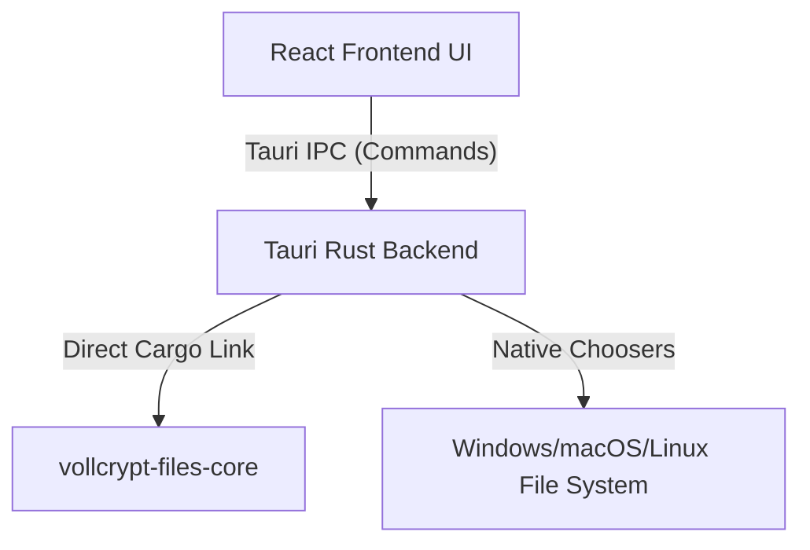

# Vollcrypt Desktop App Module Documentation

**Frameless, dark-mode native desktop application for high-performance local file and text cryptography, built with Tauri (Rust) and React + TypeScript + Vanilla CSS.**

---

## 🏗 Architectural Design

Vollcrypt Desktop is built as a hybrid desktop application utilizing **Tauri v2** for the application runtime and native OS integrations, and **React + Vanilla CSS** for the user interface.



### 1. Tauri Rust Backend (`src-tauri/`)
- Interoperates natively with the [vollcrypt-files-core](file:///c:/Users/iTopya/Desktop/Project/vollcrypt/vollcrypt-files/core) Rust crate.
- Exposes secure native commands to the frontend via Tauri's IPC (Inter-Process Communication) layer.
- Handles multi-threaded cryptographic file operations, native file dialogs, and OS window management safely.

### 2. React + TypeScript Frontend (`src/`)
- Styled using a custom, high-fidelity dark-mode interface with orange highlights.
- Border outlines on Webview click are reset globally (`outline: none !important`) to enforce a flat, premium design.
- Communication with the Rust backend is type-safe and bound using `@tauri-apps/api`.

### 3. Custom Frameless UI Window
- Native window titlebars and borders are disabled (`"decorations": false`) for a cohesive, modern layout.
- Custom titlebar controls are built in React with window dragging regions (`data-tauri-drag-region`), minimize, maximize/maximize-toggle, and close functions.
- A GitHub repository link button is integrated next to the window controls, using Tauri's native opener API.
- Frameless Windows 11 colored focus borders are disabled using `"shadow": false` to ensure a consistent dark background silhouette.

---

## 🔒 Cryptographic Capabilities

The desktop app encapsulates the following functionalities:

### 1. Symmetric File Cryptography
- Derives strong keys from user-specified passwords using **Argon2id** (customizable parameters) or **PBKDF2-SHA256**.
- Streams file contents in chunks utilizing **AES-256-GCM** for maximum performance and minimum memory footprint.
- Automatically saves encrypted files with the `.voll` extension.

### 2. Asymmetric Keypair Generator
- Generates post-quantum hybrid keypairs containing:
  - **ML-KEM-768** (FIPS 203) for quantum-resistant key transport.
  - **X25519** (ECDH) for classical forward secrecy.
  - **Ed25519** for digital signature and sender authenticity.
- Exports public key files (`.pub`) and private key files (`.sec`) securely.

### 3. Asymmetric File Cryptography
- Encrypts target files to a recipient's public key (`.pub`) using the ML-KEM + X25519 hybrid exchange.
- Decrypts files using the recipient's private key (`.sec`).
- Verifies sender signature on decryption to prevent key substitution and MITM attacks.

### 4. Threshold (t-of-n) SSS Wrap Mode
- Secures container keys under a Shamir Secret Sharing (SSS) wrap policy over GF(2^8).
- Automatically splits the container's Threshold Master Secret (TMS) into $n$ SSS shares.
- Outputs copyable and distributable share strings prefixed with `vcs_` and protected by truncated SHA-256 integrity checksums.
- Restores key access and decrypts containers directly once at least $t$ valid shares are supplied.

### 5. Sovereign Sealing & Crypto-Shredding
- Offers a GDPR-compliant irreversible deletion mechanism for containers:
  - **Seal Mode**: Erases all key-wrapping entries from the container header, keeping the encrypted payload intact but completely keyless (auditable zero-recoverability).
  - **Purge Mode**: Erases all key-wrapping entries and overwrites/zeroizes the ciphertext block payload on disk (complete crypto-shredding).
- Supports signing the sealed marker with a digital key (Ed25519 or Post-Quantum) for proof-of-erasure audits.

### 6. Shield Integrity Verification Policies
- Lets users configure and audit container integrity signature policies before decryption:
  - **Release Modes**: Choose between strict double-pass verification (`ReleaseMode::Verified`) or speed-focused on-the-fly (`ReleaseMode::Streaming`) streaming.
  - **Tamper Reactions**: Define reactive policies (Abort, Abort & Report, or Attempt Block Recovery) when container anomalies, timestamp rollbacks, or founder anchor mismatches are detected.

### 7. Text Cryptography & File Interoperability
- In-memory text encryption/decryption yielding Base64-encoded container packages.
- Features **binary file compatibility**:
  - Saved encrypted texts are decoded back to raw binary bytes and written to disk as `.voll` container files.
  - Users can decrypt these `.voll` text container files directly in either the Text decryption or File decryption tabs.
- Decrypted text files automatically default to `.txt` extension presets on picker launch.

---

## 💻 OS Compatibility & Architectures

### 1. Windows 10 & Windows 11 Support
Tauri uses the Microsoft WebView2 runtime to render the frontend.
- **Windows 11:** WebView2 is pre-installed natively in the operating system.
- **Windows 10:** To support older versions of Windows 10, the installer is configured with `"webviewInstallMode": { "type": "downloadBootstrapper" }` in [tauri.conf.json](file:///c:/Users/iTopya/Desktop/Project/vollcrypt/vollcrypt-desktop/src-tauri/tauri.conf.json). If WebView2 is missing on the client PC, the installer downloads and runs the WebView2 Bootstrapper automatically.

### 2. Multi-Architecture Configurations
The desktop application compiles for the following architectures:
- **x64** (`x86_64-pc-windows-msvc` / `x86_64-apple-darwin` / `x86_64-unknown-linux-gnu`)
- **ARM64** (`aarch64-pc-windows-msvc` / `aarch64-apple-darwin`)
- **x86** (`i686-pc-windows-msvc` 32-bit Windows)

---

## 🛡️ Security & Privacy Features

- **100% Local Processing:** The application runs entirely offline. It does not initiate network calls, check home, or transmit telemetry.
- **GDPR & ISO Compliant:** By keeping data processing fully on the user's machine, no personal data or decryption keys ever leave local memory, adhering to zero-trust principles.
- **Uninstaller Safety:** When the application is uninstalled:
  - Application binaries, registry settings, AppData folders, and shortcuts are deleted.
  - **User-encrypted files (`.voll` documents) are preserved** and never deleted, protecting user data from accidental loss.

---

## ⚙️ GitHub CI/CD Workflows

CI/CD pipelines are split into separate workflows to prevent build conflicts:

- 🖥️ **Desktop CI ([ci-desktop.yml](file:///c:/Users/iTopya/Desktop/Project/vollcrypt/.github/workflows/ci-desktop.yml))**: Installs Linux build dependencies (libwebkit2gtk-4.1, libxdo) and verifies Rust & React compilation on every push affecting the desktop directory.
- 📦 **Desktop Release ([release-desktop.yml](file:///c:/Users/iTopya/Desktop/Project/vollcrypt/.github/workflows/release-desktop.yml))**:
  - Triggers on tag pushes (`v*`) or manually via the GitHub Actions UI (`workflow_dispatch`).
  - Compiles and bundles installers for Windows (x64, ARM64, x86), macOS (Intel, Apple Silicon), and Linux (x64 deb & AppImage) and uploads them to a draft GitHub Release.

---

## 🚀 Building & Running Locally

### Prerequisites
- Node.js LTS (≥ 18)
- Rust (Stable ≥ 1.76)
- C++ Build Tools (e.g. Visual Studio Build Tools on Windows)

### Steps

```bash
# 1. Navigate to the desktop directory
cd vollcrypt-desktop

# 2. Install NPM dependencies
npm install

# 3. Start development server (hot-reloads frontend and backend)
npm run tauri dev

# 4. Compile and package production installers
npm run tauri build
```

The compiled installers will be located under:
- MSI Installer: `target/release/bundle/msi/`
- EXE Installer: `target/release/bundle/nsis/`
