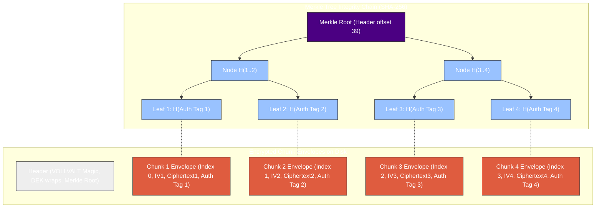
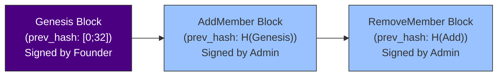

# Vollcrypt Files

High-performance, chunk-based End-to-End Encrypted (E2EE) file/stream encryption core for Node.js, WebAssembly, and Rust.

---

This module provides high-performance stream encryption, cryptographic access control, and chunk integrity verification, designed for handling large files safely without loading them entirely into memory.

## Architecture and Stream Design

Vollcrypt Files operates on a chunk-by-chunk processing paradigm. Below is the block layout visualizing the relationship between the File Header, chunk envelopes, the Merkle Tree, and out-of-order seekability:



---

## Key Capabilities

### 1. Multi-Mode Key Wrapping
Vollcrypt Files supports multiple ways to wrap and protect the file-specific Data Encryption Key (DEK):
*   **Password-Based Wrapping:** Derives a Key Encryption Key (KEK) using PBKDF2-SHA256 (600k iterations) or Argon2id (default/interactive parameters), wrapping the DEK with AES-256 Key Wrap (AES-KW).
*   **Asymmetric Recipient Wrapping:** Uses a Post-Quantum Hybrid Key Encapsulation Mechanism (X25519 + ML-KEM-768) to encapsulate the DEK. The KEK is derived via HKDF-SHA256 using the classical and post-quantum shared secrets.
*   **Group wrapping:** Supports encrypting the DEK under a symmetric Group Key (GK), which is itself managed and rotated through a signed, hash-linked Group Manifest.

### 2. Stream-Friendly Symmetric Engine
*   **Chunk-Based Encryption:** Files are split into standard chunks (default: 1,048,576 bytes). Each chunk is encrypted independently using AES-256-GCM.
*   **Cryptographic Domain Separation:** Rather than using the DEK directly, each chunk is encrypted using a unique subkey derived via HKDF-SHA256 from the DEK, the 16-byte random file ID, and the chunk index.
*   **Out-of-Order Decryption:** Allows instant random-access seeking. Any chunk can be decrypted independently given its index, without decrypting preceding chunks.

> [!NOTE]
> **Stream-Friendly vs. Two-Pass Encryption:**
> Since the Merkle Root of all chunk authentication tags is stored in the **File Header**, file/stream encryption is a **Two-Pass** operation (or requires a seekable output). For live, non-seekable streams (e.g., streaming over a network socket directly as it is encrypted), the sender must process the entire payload to compute the Merkle Root before transmitting the header. For seekable streams (like local disk writes), a placeholder header can be written first, chunks encrypted in a single pass, and the header rewritten once the Merkle Root is computed.

### 3. Signed, Hash-Linked Group Manifest
To support multi-member groups:
*   **Operation Log:** The manifest records the lifecycle of the group through operations: `Genesis`, `AddMember`, and `RemoveMember`.
*   **Ed25519 Signatures:** Every operation in the log must be signed by the group's founder/admin.
*   **Cryptographic Chaining:** Each operation contains the SHA-256 hash of the complete preceding operation, forming an immutable hash chain starting from the Genesis block.
*   **Lazy Revocation:** Removing a member does not require immediate re-encryption of all historical files. The removed member is immediately blocked from acquiring future keys from the manifest, while historical access is technically retained via previously cached keys.



### 4. Merkle Tree Integrity Verification
*   **Chunk-Substitution Protection:** To prevent malicious storage servers from replacing or swapping chunks, a Merkle Tree is constructed over the authentication tags of all chunk envelopes.
*   **Merkle Proofs:** Individual chunks can be verified for integrity by validating their chunk leaf hash and associated Merkle proof against the trusted root hash stored in the file header.

### 5. Pipelined I/O & CPU Parallelism
To maximize CPU and NVMe SSD throughput, Vollcrypt Files implements bounded-memory, parallel pipelined file encryption and decryption:
*   **Bounded Memory Consumption:** Employs bounded channels to buffer at most `num_workers * 2` chunks, strictly capping heap usage to $O(\text{num\_workers} \times \text{chunk\_size})$ regardless of file size.
*   **Out-of-order Processing with Sequential Write:** Crypto worker threads encrypt/decrypt chunks concurrently out-of-order, while a re-ordering buffer sequentially writes them to the target file.
*   **Zero-Seek Decryption:** The decryption engine consumes input bytes sequentially, allowing direct streaming decryption from non-seekable streams (like network sockets or pipes).

---

## Technical Specifications

### File Header Binary Layout
The header contains critical file metadata and the wraps protecting the DEK. All multibyte integers are written in Big-Endian (BE) format.

| Offset | Length | Type | Description |
| :--- | :--- | :--- | :--- |
| 0 | 8 | Bytes | Magic Bytes (`VOLLVALT`) |
| 8 | 1 | u8 | Version (1) |
| 9 | 1 | u8 | Mode (0: Password, 1: Recipient, 2: Group) |
| 10 | 1 | u8 | Cipher ID (0: AES-256-GCM) |
| 11 | 16 | Bytes | File ID (Randomly generated) |
| 27 | 4 | u32 BE | Chunk Size (default: 1,048,576) |
| 31 | 8 | u64 BE | Plaintext Size (in bytes) |
| 39 | 32 | Bytes | Merkle Root |
| 71 | 1 | u8 | Wrap Count |
| 72 | 4 | Bytes | Reserved (All zeroes) |
| 76 | 4 | u32 BE | Variable Length (Length of wrapped keys) |
| 80 | Var | Structs | Concatenated list of `WrapEntry` |

### Wrap Entry Binary Layouts
Each wrap entry starts with a 1-byte `wrap_type` and a 2-byte BE `payload_len`.

#### Type 0: Password PBKDF2 (Payload Length = 60)
*   `0..1`: Wrap Type (0x00)
*   `1..3`: Payload Length (0x003C - 60 bytes)
*   `3..7`: Iterations (u32 BE, typically 600,000)
*   `7..23`: Salt (16 bytes)
*   `23..63`: Wrapped DEK (40 bytes AES-KW)

#### Type 1: Password Argon2id (Payload Length = 68)
*   `0..1`: Wrap Type (0x01)
*   `1..3`: Payload Length (0x0044 - 68 bytes)
*   `3..7`: Memory Cost (u32 BE)
*   `7..11`: Time Cost (u32 BE)
*   `11..15`: Parallelism Cost (u32 BE)
*   `15..31`: Salt (16 bytes)
*   `31..71`: Wrapped DEK (40 bytes AES-KW)

#### Type 2: Hybrid KEM (Payload Length = 1180)
*   `0..1`: Wrap Type (0x02)
*   `1..3`: Payload Length (0x049C - 1180 bytes)
*   `3..19`: Recipient ID (16 bytes)
*   `19..23`: Group Key Version (u32 BE)
*   `23..55`: X25519 Ephemeral Public Key (32 bytes)
*   `55..1143`: ML-KEM-768 Ciphertext (1088 bytes)
*   `1143..1183`: Wrapped Key (40 bytes AES-KW)

#### Type 3: Group Wrap (Payload Length = 60)
*   `0..1`: Wrap Type (0x03)
*   `1..3`: Payload Length (0x003C - 60 bytes)
*   `3..19`: Group ID (16 bytes)
*   `19..23`: Group Key Version (u32 BE)
*   `23..63`: Wrapped DEK (40 bytes AES-KW)

### Chunk Envelope Binary Layout
Each encrypted chunk is stored as a sequential binary chunk envelope:

| Offset | Length | Type | Description |
| :--- | :--- | :--- | :--- |
| 0 | 4 | u32 BE | Chunk Index (0-based) |
| 4 | 12 | Bytes | IV / Nonce (12 bytes) |
| 16 | Var | Bytes | Ciphertext (Plaintext size) |
| 16 + Var | 16 | Bytes | AES-256-GCM Authentication Tag |

---

## Programmatic Integration Example (Out-of-Order Seek & Verify)

This TypeScript pseudocode details how an integrator reads any random chunk offset from an encrypted file, verifies its Merkle proof, and decrypts it independently.

```ts
import { 
  Header, 
  decryptChunk, 
  verifyMerkleProof, 
  chunkLeafHash 
} from '@vollcrypt/file';
import * as fs from 'fs/promises';

interface FileHandle {
  read(buffer: Buffer, offset: number, length: number, position: number): Promise<{ bytesRead: number }>;
}

async function seekAndDecryptChunk(
  file: FileHandle,
  targetByteOffset: number,
  dek: Buffer,
  merkleProofs: Buffer[][] // Pre-calculated or fetched from metadata server
): Promise<Buffer> {
  // 1. Read and parse the File Header
  const headerBuffer = Buffer.alloc(10000); // Max possible header size
  await file.read(headerBuffer, 0, 10000, 0);
  const (header, headerLen) = Header.parse(headerBuffer);

  const chunkSize = header.chunkSize;
  const plaintextLength = header.plaintextSize;
  const fileId = header.fileId;
  const merkleRoot = header.merkleRoot;

  // 2. Map the byte offset to the chunk index
  const chunkIndex = Math.floor(targetByteOffset / chunkSize);
  const totalChunks = Math.ceil(plaintextLength / chunkSize);

  if (chunkIndex >= totalChunks) {
    throw new Error("Target offset exceeds file size");
  }

  // 3. Calculate envelope positions on disk
  // Standard chunk envelopes have a size of: 32 + ciphertextLength (which equals plaintext size)
  const isLastChunk = chunkIndex === totalChunks - 1;
  const chunkPlaintextLen = isLastChunk 
    ? (plaintextLength % chunkSize || chunkSize) 
    : chunkSize;
  
  const envelopeSize = 32 + chunkPlaintextLen;

  // Compute offset by summing all preceding chunk envelopes
  // Since standard chunks are uniform, we can calculate directly:
  const targetEnvelopeDiskPos = headerLen + chunkIndex * (32 + chunkSize);

  // 4. Read the target chunk envelope from disk
  const envelopeBuffer = Buffer.alloc(envelopeSize);
  await file.read(envelopeBuffer, 0, envelopeSize, targetEnvelopeDiskPos);

  // Parse the envelope
  const parsedIndex = envelopeBuffer.readUInt32BE(0);
  const iv = envelopeBuffer.subarray(4, 16);
  const ciphertext = envelopeBuffer.subarray(16, 16 + chunkPlaintextLen);
  const authTag = envelopeBuffer.subarray(16 + chunkPlaintextLen, envelopeSize);

  // 5. Verify the integrity of the chunk tag using the Merkle Root
  const leafHash = chunkLeafHash(authTag);
  const proof = merkleProofs[chunkIndex];

  const isIntegrityValid = verifyMerkleProof(leafHash, proof, merkleRoot, chunkIndex, totalChunks);
  if (!isIntegrityValid) {
    throw new Error(`Security Exception: Chunk ${chunkIndex} authentication tag failed Merkle Tree validation!`);
  }

  // 6. Decrypt the verified chunk
  const chunkEnvelope = {
    chunkIndex: parsedIndex,
    iv,
    ciphertext,
    tag: authTag
  };

  const decryptedPlaintext = decryptChunk(dek, fileId, chunkIndex, chunkEnvelope);
  return decryptedPlaintext;
}
```

---

## Cryptographic Security Policies

1.  **Memory Protection:** All sensitive keying materials (including Key Encryption Keys, ephemeral Diffie-Hellman secrets, and recipient secret keys) implement the `Zeroize` and `ZeroizeOnDrop` traits to ensure they are scrubbed from memory immediately after use.
2.  **Hybrid KDF Context:** The KDF derivation for hybrid KEM KEKs uses the context info buffer: `vollcrypt-file-hybrid-kem-v1 || recipient_id (16B) || gk_version (4B BE)`.
3.  **Chunk Key Context:** The subkey for chunk $i$ is derived using the context info buffer: `vollcrypt-file-chunk-kdf-v1-chunk- || chunk_index (4B BE)`.
4.  **No Unsafe Code:** The entire codebase is implemented in 100% safe Rust, ensuring memory safety guarantees.

---

## Performance & Optimizations

Vollcrypt Files has undergone targeted performance optimizations to achieve peak single-core throughput and resolve encryption/decryption asymmetry:

- **Merkle Leaf Hash Optimization:** Omits ciphertext payload from Merkle tree leaf hashing (only hashing `chunk_index || iv || tag`), avoiding double-pass processing (AES-GCM + SHA-256) of full file contents.
- **Deterministic IV Derivation:** Eliminates system-call overhead by replacing `OsRng` in the encryption loop with a 44-byte HKDF expansion to derive both chunk subkeys and IVs deterministically.
- **Architecture-Specific Speedups:** Set default compilation profile targeting `x86-64-v3`, allowing optional native overrides (`RUSTFLAGS="-C target-cpu=native"`) to fully unlock hardware acceleration (AVX2, AES-NI, SHA-NI).

### Benchmark Results (AMD Ryzen 5 7500F @ 3.70 GHz)

| Operation | Input Size / Scope | Before Optimization | After Optimization | Speedup / Improvement |
| :--- | :--- | :--- | :--- | :--- |
| **`encrypt_chunk`** | 4 KB | 351.91 MB/s | **1502.40 MB/s** | **4.27x** (Bottleneck Resolved) |
| **`decrypt_chunk`** | 4 KB | 1446.76 MB/s | **1446.76 MB/s** | **1.00x** (Perfect Speed Symmetry) |
| **`encrypt_chunk`** | 64 KB | 1911.31 MB/s | **2083.33 MB/s** | **1.09x** |
| **`decrypt_chunk`** | 64 KB | 1849.11 MB/s | **2062.71 MB/s** | **1.12x** |
| **Single-Core 1 GB File** | File Level | 1.18 s (~847 MB/s) | **0.54 s (~1851 MB/s)** | **2.18x** (Throughput doubled) |
| **Multi-Core 1 GB File** | File Level | 0.29 s (~3.44 GB/s) | **0.15 s (~6.67 GB/s)** | **1.93x** (Peak Multi-Core win) |

### Test & Security Scorecard

All workspace test suites and boundary-value stress tests compiled and passed successfully:

- **Stress Tests:** `vollcrypt-files-stress` (16/16 pass)
- **Hardening:** Verified Bit-flip resistance (8,000 flips, 0 decrypted), Tag forgery resistance (1M attempts, 0 accepted), Header tampering protection, and Replay/Substitution protection.
- **Linter:** 100% clean Clippy builds under `-- -D warnings` on all target formats.

