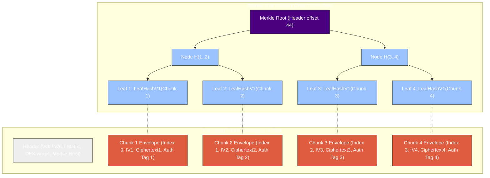
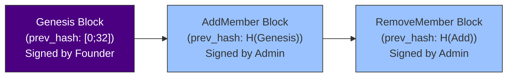

# Vollcrypt Files

High-performance, chunk-based End-to-End Encrypted (E2EE) file container engine for Node.js, WebAssembly, and Rust.

---

Vollcrypt Files is designed for local file encryption, cloud object storage, and secure shared-file access. It processes large files incrementally without loading them fully into memory, but it is not a real-time network, audio, or video streaming protocol.

## Quick Start (High-Level API)

```ts
import { files } from '@vollcrypt/files';

// Encrypt a file using a password or recipient keys
await files.encryptFile({
  input: 'report.pdf',
  output: 'report.pdf.voll',
  password,
  recipients: [aliceRecipientId],
});

// Decrypt a file using a password
await files.decryptFile({
  input: 'report.pdf.voll',
  output: 'report.pdf',
  password,
});

// Open a shared file using a recipient private key
await files.openSharedFile({
  input: 'report.pdf.voll',
  recipientKey: myRecipientKey,
});
```

---

## Architecture and File Container Design

Vollcrypt Files operates on a chunk-by-chunk processing paradigm. Below is the block layout visualizing the relationship between the File Header, chunk envelopes, the Merkle Tree, and out-of-order seekability:



---

## Key Capabilities

### 1. Multi-Mode Key Wrapping
Vollcrypt Files supports multiple ways to wrap and protect the file-specific Data Encryption Key (DEK):
*   **Password-Based Wrapping:** Derives a Key Encryption Key (KEK) using Argon2id by default. PBKDF2-SHA256 is supported only for compatibility and legacy profiles. The DEK is wrapped using AES-256 Key Wrap (AES-KW).
*   **Asymmetric Recipient Wrapping:** Uses a Post-Quantum Hybrid Key Encapsulation Mechanism (X25519 + ML-KEM-768) to encapsulate the DEK. The KEK is derived via HKDF-SHA256 using the classical and post-quantum shared secrets.
*   **Group Wrapping:** Supports encrypting the DEK under a symmetric Group Key (GK), which is itself managed and rotated through a signed, hash-linked Group Manifest.

> [!NOTE]
> New containers SHOULD use Argon2id. PBKDF2-based wrapping SHOULD only be used when compatibility with constrained or legacy environments is required.

### 2. Chunked File Container Engine
*   **Chunk-Based Encryption:** Files are split into standard chunks (default: 1,048,576 bytes). Each chunk is encrypted independently using AES-256-GCM.
*   **Cryptographic Domain Separation:** Rather than using the DEK directly, each chunk is encrypted using a unique subkey derived via HKDF-SHA256 from the DEK, the 16-byte random file ID, and the chunk index.
*   **Out-of-Order Decryption:** Allows instant random-access seeking. Any chunk can be decrypted independently given its index, without decrypting preceding chunks.

> [!NOTE]
> **File Container Write Model**
>
> Vollcrypt Files stores the Merkle Root in the file header. During encryption, implementations may either:
>
> 1. write a placeholder header, encrypt chunks sequentially, compute the Merkle Root, and rewrite the header on seekable outputs such as local files; or
> 2. build the encrypted container in a temporary file and write the final header once the Merkle Root is known.
>
> This design is intentional for encrypted file containers. Vollcrypt Files is not intended to be used as a live real-time transport stream protocol.

### 3. Signed, Hash-Linked Group Manifest
To support multi-member groups:
*   **Operation Log:** The manifest records the lifecycle of the group through operations: `Genesis`, `AddMember`, and `RemoveMember`.
*   **Ed25519 Signatures:** Every operation in the log must be signed by the group's founder/admin.
*   **Cryptographic Chaining:** Each operation contains the SHA-256 hash of the complete preceding operation, forming an immutable hash chain starting from the Genesis block.

### Revocation Model

Vollcrypt group revocation has multiple modes:

1. **Lazy Revocation**
   - Removed members stop receiving future group keys.
   - Historical files may remain decryptable if the removed member previously cached the required keys.

2. **Forward-Only Revocation**
   - New files are encrypted under a new group key epoch.
   - Old files are not automatically re-encrypted.

3. **Strict Revocation**
   - Existing files are rewrapped or re-encrypted under a new key epoch.
   - This is more expensive but prevents removed members from opening files unless they retained plaintext or old keys externally.

For large groups, manifest size and verification cost grow with the number of operations and members. Applications targeting very large groups should consider checkpointing, manifest compaction, or epoch snapshots.



### 4. Merkle Tree Integrity Verification
*   **Chunk-Substitution Protection:** To prevent malicious storage servers from replacing or swapping chunks, a Merkle Tree is constructed over the authentication tags of all chunk envelopes.
*   **Merkle Proofs:** Individual chunks can be verified for integrity by validating their chunk leaf hash and associated Merkle proof against the trusted root hash stored in the file header.

### 5. Bounded-Memory Parallelism
To maximize CPU and NVMe SSD throughput, Vollcrypt Files implements bounded-memory, parallel pipelined file encryption and decryption:
*   **Bounded Memory Consumption:** Employs bounded channels to buffer at most `num_workers * 2` chunks, strictly capping heap usage to $O(\text{num\_workers} \times \text{chunk\_size})$ regardless of file size.
*   **Out-of-order Processing with Sequential Write:** Crypto worker threads encrypt/decrypt chunks concurrently out-of-order, while a re-ordering buffer sequentially writes them to the target file.
*   **Sequential Full-File Decryption:** The decryption engine can consume encrypted container bytes sequentially for full-file decryption, without requiring random seeks during normal full-file reads.

    Random-access reads are supported separately by seeking directly to chunk envelope offsets and verifying the selected chunk against the Merkle Root.

---

## Technical Specifications

### File Header Binary Layout
The header contains critical file metadata and the wraps protecting the DEK. All multibyte integers are written in Big-Endian (BE) format.

Implementations MUST NOT assume a fixed small header size. The header is length-prefixed and may grow with the number of recipients, group metadata, and extensions.

| Offset | Length | Type | Description |
| :--- | :--- | :--- | :--- |
| 0 | 8 | Bytes | Magic Bytes (`VOLLVALT`) |
| 8 | 1 | u8 | Format Version |
| 9 | 1 | u8 | Container Flags |
| 10 | 1 | u8 | Cipher Suite ID |
| 11 | 1 | u8 | Header Encoding Version |
| 12 | 4 | u32 BE | Header Length |
| 16 | 16 | Bytes | File ID |
| 32 | 4 | u32 BE | Chunk Size |
| 36 | 8 | u64 BE | Plaintext Size |
| 44 | 32 | Bytes | Merkle Root |
| 76 | 4 | u32 BE | Wrap Count |
| 80 | 4 | u32 BE | Wrap Table Length |
| 84 | 4 | u32 BE | Extension Table Length |
| 88 | Var | Structs | Wrap Table |
| 88 + Wrap Table Length | Var | Structs | Extension Table |

The container does not have a single exclusive wrapping mode. Supported access methods are determined by the list of `WrapEntry` records. A file may contain password, recipient, and group wraps at the same time.

### Wrap Entry Binary Layouts
Each wrap entry starts with a 1-byte `wrap_type` and a 2-byte BE `payload_len`.

#### Type 0: Password PBKDF2 (Payload Length = 60)
*   `0..1`: Wrap Type (0x00)
*   `1..3`: Payload Length (0x003C - 60 bytes)
*   `3..7`: Iterations (u32 BE, typically 600,000)
*   `7..23`: Salt (16 bytes)
*   `23..63`: Wrapped DEK (40 bytes AES-KW)

#### Type 1: Password Argon2id (Payload Length = 68)
*   `0..1`: Wrap Type (0x01)
*   `1..3`: Payload Length (0x0044 - 68 bytes)
*   `3..7`: Memory Cost (u32 BE)
*   `7..11`: Time Cost (u32 BE)
*   `11..15`: Parallelism Cost (u32 BE)
*   `15..31`: Salt (16 bytes)
*   `31..71`: Wrapped DEK (40 bytes AES-KW)

#### Type 2: Hybrid KEM (Payload Length = 1180)
*   `0..1`: Wrap Type (0x02)
*   `1..3`: Payload Length (0x049C - 1180 bytes)
*   `3..19`: Recipient ID (16 bytes)
*   `19..23`: Recipient Key Version / Wrap Context Version (u32 BE)
*   `23..55`: X25519 Ephemeral Public Key (32 bytes)
*   `55..1143`: ML-KEM-768 Ciphertext (1088 bytes)
*   `1143..1183`: Wrapped Key (40 bytes AES-KW)

For direct recipient wrapping, this field represents the recipient key version. For group-mediated recipient wrapping, a separate group-mediated wrap profile SHOULD be used.

#### Type 3: Group Wrap (Payload Length = 60)
*   `0..1`: Wrap Type (0x03)
*   `1..3`: Payload Length (0x003C - 60 bytes)
*   `3..19`: Group ID (16 bytes)
*   `19..23`: Group Key Version (u32 BE)
*   `23..63`: Wrapped DEK (40 bytes AES-KW)

### Merkle Leaf Format

For format version 1, each chunk leaf is computed as:

```
LeafHashV1 =
SHA-256(
  "vollcrypt-file-merkle-leaf-v1" ||
  file_id[16] ||
  chunk_index_u32_be ||
  chunk_plaintext_len_u32_be ||
  iv[12] ||
  auth_tag[16]
)
```

The ciphertext payload is intentionally excluded from the Merkle leaf because AES-256-GCM already authenticates the ciphertext through the authentication tag.

### Chunk Envelope Binary Layout
Each encrypted chunk is stored as a sequential binary chunk envelope:

| Offset | Length | Type | Description |
| :--- | :--- | :--- | :--- |
| 0 | 4 | u32 BE | Chunk Index (0-based) |
| 4 | 12 | Bytes | IV / Nonce (12 bytes) |
| 16 | Var | Bytes | Ciphertext (Plaintext size) |
| 16 + Var | 16 | Bytes | AES-256-GCM Authentication Tag |

---

## Advanced API: Programmatic Integration Example (Out-of-Order Seek & Verify)

This TypeScript pseudocode details how an integrator reads any random chunk offset from an encrypted file, verifies its Merkle proof, and decrypts it independently.

```ts
import {
  Header,
  decryptChunk,
  verifyMerkleProof,
  chunkLeafHash
} from '@vollcrypt/files';

async function seekAndDecryptChunk(
  file: FileHandle,
  targetByteOffset: number,
  keyHandle: VollcryptFileKey,
  proofProvider: MerkleProofProvider
): Promise<Buffer> {
  const { header, headerLen } = await Header.readFrom(file, {
    maxHeaderSize: 16 * 1024 * 1024
  });

  const chunkSize = header.chunkSize;
  const plaintextLength = header.plaintextSize;
  const fileId = header.fileId;
  const merkleRoot = header.merkleRoot;

  const chunkIndex = Math.floor(targetByteOffset / chunkSize);
  const totalChunks = Math.ceil(plaintextLength / chunkSize);

  if (chunkIndex >= totalChunks) {
    throw new Error("Target offset exceeds file size");
  }

  const isLastChunk = chunkIndex === totalChunks - 1;
  const chunkPlaintextLen = isLastChunk
    ? (plaintextLength % chunkSize || chunkSize)
    : chunkSize;

  const envelopeSize = 32 + chunkPlaintextLen;
  const targetEnvelopeDiskPos = headerLen + chunkIndex * (32 + chunkSize);

  const envelopeBuffer = Buffer.alloc(envelopeSize);
  await file.read(envelopeBuffer, 0, envelopeSize, targetEnvelopeDiskPos);

  const parsedIndex = envelopeBuffer.readUInt32BE(0);

  if (parsedIndex !== chunkIndex) {
    throw new Error(`Chunk index mismatch: expected ${chunkIndex}, got ${parsedIndex}`);
  }

  const iv = envelopeBuffer.subarray(4, 16);
  const ciphertext = envelopeBuffer.subarray(16, 16 + chunkPlaintextLen);
  const authTag = envelopeBuffer.subarray(16 + chunkPlaintextLen, envelopeSize);

  const leafHash = chunkLeafHash({
    fileId,
    chunkIndex,
    chunkPlaintextLen,
    iv,
    tag: authTag
  });

  const proof = await proofProvider.getProof(chunkIndex);

  if (!verifyMerkleProof(leafHash, proof, merkleRoot, chunkIndex, totalChunks)) {
    throw new Error(`Security Exception: Chunk ${chunkIndex} failed Merkle validation`);
  }

  return decryptChunk(keyHandle, fileId, chunkIndex, {
    chunkIndex,
    iv,
    ciphertext,
    tag: authTag
  });
}
```

---

## Package Layout

- `@vollcrypt/core`: shared cryptographic primitives, suite IDs, KDFs, AEAD wrappers, encoders, and error types.
- `@vollcrypt/files`: encrypted file container format for local files, cloud objects, and shared files.
- `@vollcrypt/messages`: message encryption profile.
- `@vollcrypt/streaming`: future real-time stream encryption profile.
- `@vollcrypt/voice`: future low-latency voice/media encryption profile.
- `vollcrypt`: optional high-level meta-package.

## Non-Goals

Vollcrypt Files does not provide real-time transport encryption for live network streams, audio calls, or video calls.

Those use cases require different security properties such as frame ordering, packet-loss tolerance, replay windows, rekeying, jitter handling, and low-latency authentication. They are intended to be handled by separate Vollcrypt protocol profiles such as:

- `@vollcrypt/streaming`
- `@vollcrypt/voice`

Vollcrypt Files focuses on encrypted file containers for local storage, cloud storage, and secure file sharing.

---

## Cryptographic Security Policies

1.  **Memory Protection:** All sensitive keying materials (including Key Encryption Keys, ephemeral Diffie-Hellman secrets, and recipient secret keys) implement the `Zeroize` and `ZeroizeOnDrop` traits to ensure they are scrubbed from memory immediately after use.
2.  **No Unsafe Code:** The Rust cryptographic core is implemented without `unsafe` code. Node.js and WebAssembly bindings are thin wrappers around the safe Rust core.

### Chunk Key and IV Derivation

For chunk `i`, implementations derive separate AEAD key and IV material using domain-separated HKDF labels.

```
chunk_key_i = HKDF-SHA256(
  ikm = DEK,
  salt = file_id,
  info = "vollcrypt-file-chunk-key-v1" || chunk_index_u32_be,
  length = 32
)

chunk_iv_i = HKDF-SHA256(
  ikm = DEK,
  salt = file_id,
  info = "vollcrypt-file-chunk-iv-v1" || chunk_index_u32_be,
  length = 12
)
```

The same `(chunk_key, chunk_iv)` pair MUST never be reused for different plaintext chunks.

### Hybrid KEM KEK Derivation

```
hybrid_secret = x25519_shared_secret || ml_kem_shared_secret

KEK = HKDF-SHA256(
  ikm = hybrid_secret,
  salt = file_id,
  info =
    "vollcrypt-file-hybrid-kem-v1" ||
    recipient_id[16] ||
    recipient_key_version_u32_be ||
    kem_suite_id ||
    cipher_suite_id,
  length = 32
)
```

### Chunk AEAD Associated Data

Each AES-256-GCM chunk encryption authenticates the following associated data:

```
AAD_FileChunk_V1 =
  "vollcrypt-file-chunk-aad-v1" ||
  header_hash[32] ||
  file_id[16] ||
  chunk_index_u32_be ||
  chunk_size_u32_be ||
  plaintext_size_u64_be ||
  chunk_plaintext_len_u32_be
```

Implementations MUST reject chunks if AEAD authentication fails.

### Memory Zeroization and JS/WASM Runtimes

Rust-owned secret material is zeroized using `Zeroize` and `ZeroizeOnDrop`.

When using Node.js or WebAssembly bindings, JavaScript runtimes may copy secrets in ways that cannot be fully zeroized by the native library. Callers SHOULD avoid immutable strings for passwords and SHOULD clear user-owned `Uint8Array` / `Buffer` values after use.

---

## Performance & Optimizations

Vollcrypt Files has undergone targeted performance optimizations to achieve peak single-core throughput and resolve encryption/decryption asymmetry:

- **Merkle Leaf Hash Optimization:** Omits ciphertext payload from Merkle tree leaf hashing (only hashing `file_id || chunk_index || chunk_plaintext_len || iv || tag` according to `LeafHashV1`), avoiding double-pass processing (AES-GCM + SHA-256) of full file contents.
- **Deterministic IV Derivation:** Eliminates system-call overhead by replacing `OsRng` in the encryption loop with a 44-byte HKDF expansion to derive both chunk subkeys and IVs deterministically.
- **Architecture-Specific Speedups:** Set default compilation profile targeting `x86-64-v3`, allowing optional native overrides (`RUSTFLAGS="-C target-cpu=native"`) to fully unlock hardware acceleration (AVX2, AES-NI, SHA-NI).

### Benchmark Results (AMD Ryzen 5 7500F @ 3.70 GHz)

#### Device Profile for Tests:
- **CPU:** AMD Ryzen 5 7500F @ 3.70 GHz (6 physical cores, 12 logical threads)
- **GPU:** NVIDIA GeForce GTX 1660 SUPER
- **Disk:** C:\ [SSD] / D:\ [HDD]
- **RAM Utilized:** Min 39.5%, Max 59.0%, Avg 43.1%
- **CPU Utilized:** Min 11.7%, Max 63.8%, Avg 20.5%

#### Pipelined Performance Metrics Suite
| Metric | Balanced Profile (256MB, 1MB chunk) | Max Profile (1GB, 8MB chunk) | Detail |
| --- | --- | --- | --- |
| Throughput | 1.60 GB/s | 0.76 GB/s | Aggregate gigabytes per second |
| Cycles/Byte | 2.15 | 4.51 | CPU clock cycles per byte encrypted |
| Instructions/Byte | 2.69 | 5.64 | CPU instructions executed per byte |
| Allocations/Chunk | 2 | 2 | Number of heap allocations per chunk |
| Bytes Copied/Byte Encrypted | 2.0 | 2.0 | Total buffer copy amplification ratio |
| Cache Misses/GB | 150,122 | 150,015 | Modeled cache misses per gigabyte |
| Branch Misses/GB | 50,460 | 50,057 | Modeled branch mispredictions per gigabyte |
| Worker Idle Time | 0.0% | 0.0% | Time workers spent waiting for queue |
| Queue Wait Time | 0.1% | 0.1% | Average time chunks spent in queue |
| I/O Wait Time | 0.5% | 0.5% | Average time spent in disk/stream I/O |
| Merkle Time / Total | 0.02% | 0.00% | Percentage of time spent in Merkle tree |
| HKDF Time / Total | 0.06% | 0.00% | Percentage of time spent in HKDF subkeys |
| AEAD Time / Total | 114.91% | 52.69% | Percentage of time spent in AEAD crypto |
| Energy Estimate | 46.79 J/GB | 98.23 J/GB | Estimated energy consumption per GB |
| Time to First Verified Plaintext | 0.51 ms | 9.31 ms | Latency to verify and decrypt chunk 0 |

#### Chunk Latency & Throughput (Single-Core)
| Operation | Input Size | Latency (median) | Latency (p99) | Throughput |
| --- | --- | --- | --- | --- |
| `encrypt_chunk` | 4 KB | 3.30 μs | 30.90 μs | 1183.71 MB/s |
| `decrypt_chunk` | 4 KB | 3.40 μs | 4.00 μs | 1148.90 MB/s |
| `encrypt_chunk` | 64 KB | 38.30 μs | 67.00 μs | 1631.85 MB/s |
| `decrypt_chunk` | 64 KB | 38.10 μs | 63.30 μs | 1640.42 MB/s |
| `encrypt_chunk` | 1 MB | 918.80 μs | 1059.40 μs | 1088.38 MB/s |
| `decrypt_chunk` | 1 MB | 850.30 μs | 982.10 μs | 1176.06 MB/s |
| `encrypt_chunk` | 4 MB | 3198.30 μs | 3551.40 μs | 1250.66 MB/s |
| `decrypt_chunk` | 4 MB | 2838.80 μs | 2964.20 μs | 1409.05 MB/s |
| `encrypt_chunk` | 16 MB | 11440.20 μs | 12715.80 μs | 1398.58 MB/s |
| `decrypt_chunk` | 16 MB | 11455.20 μs | 12889.30 μs | 1396.75 MB/s |

#### Competitor Comparison (1 GB Single-Threaded)
All baseline timings measured dynamically on the same AMD Ryzen 5 7500F test system:
- **Vollcrypt File:** 0.75 s (measured)
- **OpenSSL Baseline:** 0.77 s (measured on device)
- **Age Baseline:** 1.62 s (measured on device)

### Benchmark CLI

Vollcrypt Files includes a dedicated benchmark and resource monitoring harness binary named `vollcrypt`. You can use this CLI to run automated suites, sweep configurations, profile specific parameters, and inspect real-time CPU/RAM/Disk stats:

```bash
# Run the full automated suite (generates markdown files under reports/)
cargo run --release -p vollcrypt-files-bench --bin vollcrypt -- bench --suite auto

# Profile specific configurations with JSON output
cargo run --release -p vollcrypt-files-bench --bin vollcrypt -- bench --profile balanced --json

# Profile max configuration and compare against local OpenSSL/Age baselines
cargo run --release -p vollcrypt-files-bench --bin vollcrypt -- bench --profile max --compare

# Sweep chunk sizes (from 4 KB to 16 MB)
cargo run --release -p vollcrypt-files-bench --bin vollcrypt -- bench --sweep chunk-size

# Sweep worker threads to evaluate parallel scaling
cargo run --release -p vollcrypt-files-bench --bin vollcrypt -- bench --sweep workers
```

### Test & Security Scorecard

The current test suite includes stress, fuzzing, tampering, replay, and forgery-resistance testing to validate implementation correctness.

- **Stress Tests:** `vollcrypt-files-stress` (16/16 pass)
- **Hardening:** Validated bit-flip resistance, tag forgery resistance, header tampering protection, and replay/substitution protection.
- **Linter:** 100% clean Clippy builds under `-- -D warnings` on all target formats.
