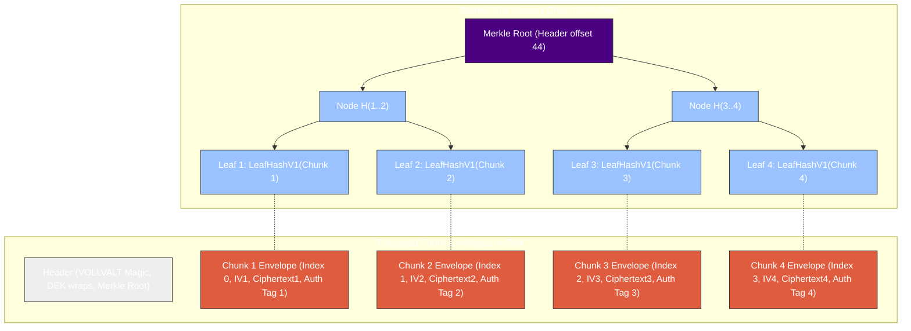
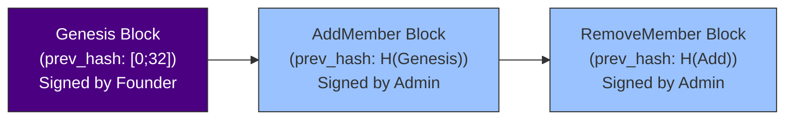

# Vollcrypt Files

High-performance, chunk-based End-to-End Encrypted (E2EE) file container engine for Node.js, WebAssembly, and Rust.

---

Vollcrypt Files is designed for local file encryption, cloud object storage, and secure shared-file access. It processes large files incrementally without loading them fully into memory, but it is not a real-time network, audio, or video streaming protocol.

This module provides high-performance chunked file encryption, cryptographic access control, and chunk integrity verification for large encrypted file containers.

## License

This package is dual-licensed under:
- GPL-3.0-only (for open-source distribution) — see the [LICENSE-GPL](LICENSE-GPL) file.
- Commercial License (for proprietary software integrations) — see the [LICENSE-COMMERCIAL.md](LICENSE-COMMERCIAL.md) file.

---

## Use Cases & Non-Goals

### Use Cases

Vollcrypt Files is intended for:
- Encrypting local files before storage.
- Storing encrypted files in untrusted cloud storage.
- Sharing encrypted files with multiple recipients.
- Opening shared encrypted files securely.
- Random-access reads over cloud range requests.
- Group-based file access with key rotation and revocation semantics.

### Non-Goals

Vollcrypt Files does not provide real-time transport encryption for live network streams, audio calls, or video calls.

Those use cases require different security properties such as frame ordering, packet-loss tolerance, replay windows, rekeying, jitter handling, and low-latency authentication. They are intended to be handled by separate Vollcrypt protocol profiles such as:
- **[Vollcrypt Messages Module Documentation (README-messages.md)](README-messages.md)**
- `@vollcrypt/streaming`
- `@vollcrypt/voice`

Vollcrypt Files focuses on encrypted file containers for local storage, cloud storage, and secure file sharing.

---

## Quick Start

### High-Level API Usage

```typescript
import { files } from '@vollcrypt/files';

// Encrypt a file using a password or recipient keys
await files.encryptFile({
  input: 'report.pdf',
  output: 'report.pdf.voll',
  password: 'my-secure-password',
  recipients: [aliceRecipientId],
});

// Decrypt a file using a password
await files.decryptFile({
  input: 'report.pdf.voll',
  output: 'report.pdf',
  password: 'my-secure-password',
});

// Open a shared file using a recipient private key
await files.openSharedFile({
  input: 'report.pdf.voll',
  recipientKey: myRecipientKey,
});
```

### Advanced Asynchronous Pipelined File API (Zero-Copy)

```typescript
import { 
  generateDek, 
  generateFileId, 
  encryptFilePipelinedAsync, 
  decryptFilePipelinedAsync 
} from "@vollcrypt/files-node";

const dek = generateDek();
const fileId = generateFileId();

// Asynchronously encrypt a file using 4 parallel thread workers
const header = await encryptFilePipelinedAsync(
  "./input.txt",
  "./input.enc",
  dek,
  fileId,
  65536, // 64 KB chunk size
  [],    // wraps
  0,     // mode (0 = Password)
  4,     // thread workers
  null   // optional signInfo
);

// Asynchronously decrypt the file
await decryptFilePipelinedAsync(
  "./input.enc",
  "./input.dec",
  dek,
  4      // thread workers
);
```

### WebAssembly (Browser) Integration

```javascript
import init, { generateDek, generateFileId } from "./pkg/vollcrypt_file_wasm.js";

async function run() {
  await init();
  
  const dek = generateDek();
  const fileId = generateFileId();
  console.log("DEK generated:", dek);
}
run();
```

---

## Architecture and File Container Design

Vollcrypt Files operates on a chunk-by-chunk file container model. The format is optimized for large local files, cloud-stored encrypted objects, random-access reads, and secure shared-file opening.

### Container Block Layout
Below is the block layout visualizing the relationship between the File Header, chunk envelopes, the Merkle Tree, and out-of-order seekability:



### Visual Layout Diagram
```
+-----------------------------------------------------------+
|                      FILE CONTAINER                       |
+-----------------------------------------------------------+
| Header:                                                   |
|   - Magic Bytes ("VOLLVALT")                              |
|   - Version & Container Flags                             |
|   - File ID & Merkle Root                                 |
|   - Wrap Table & Extension Table                          |
|   - Signature (Optional, v2 only)                         |
+-----------------------------------------------------------+
| Chunk Envelopes:                                          |
|   +-----------------------------------------------------+ |
|   | Chunk 1: Index (4B) | IV (12B) | Cipher | Tag (16B) | |
|   +-----------------------------------------------------+ |
|   | Chunk 2: Index (4B) | IV (12B) | Cipher | Tag (16B) | |
|   +-----------------------------------------------------+ |
|   | ...                                                 | |
|   +-----------------------------------------------------+ |
+-----------------------------------------------------------+
|                  Merkle Root in Header                    |
|                            /\                             |
|                           /  \                            |
|                          /    \                           |
|                         /      \                          |
|                        /\      /\                         |
|                       /  \    /  \                        |
|                      /    \  /    \                       |
|                   Leaf 1 Leaf 2 Leaf 3 Leaf 4             |
+-----------------------------------------------------------+
|  Leaf 1: LeafHashV1(Chunk 1)                              |
|  LeafHashV1 = SHA-256("vollcrypt-file-merkle-leaf-v1" ||  |
|                file_id || index || len || IV1 || Tag1)    |
+-----------------------------------------------------------+
```

### Key Capabilities

#### 1. Multi-Mode Key Wrapping
Vollcrypt Files supports multiple ways to wrap and protect the file-specific Data Encryption Key (DEK):
*   **Password-Based Wrapping:** Derives a Key Encryption Key (KEK) using Argon2id by default. PBKDF2-SHA256 is supported only for compatibility and legacy profiles. The DEK is wrapped using AES-256 Key Wrap (AES-KW).
*   **Asymmetric Recipient Wrapping:** Uses a Post-Quantum Hybrid Key Encapsulation Mechanism (X25519 + ML-KEM-768) to encapsulate the DEK. The KEK is derived via HKDF-SHA256 using the classical and post-quantum shared secrets.
*   **Group Wrapping:** Supports encrypting the DEK under a symmetric Group Key (GK), which is itself managed and rotated through a signed, hash-linked Group Manifest.

> [!NOTE]
> New containers SHOULD use Argon2id. PBKDF2-based wrapping SHOULD only be used when compatibility with constrained or legacy environments is required.

#### 2. Chunked File Container Engine
*   **Chunk-Based Encryption:** Files are split into standard chunks (default: 1,048,576 bytes / 1 MiB). Each chunk is encrypted independently using AES-256-GCM.
*   **Cryptographic Domain Separation:** Rather than using the DEK directly, each chunk is encrypted using a unique subkey derived via HKDF-SHA256 from the DEK, the 16-byte random file ID, and the chunk index.
*   **Out-of-Order Decryption:** Allows instant random-access seeking. Any chunk can be decrypted independently given its index, without decrypting preceding chunks.
*   **Chunk Size Limits:** Minimum: 4 KiB, Typical: 1 MiB to 16 MiB. A ceiling check of 16 MB is enforced during header parsing.
*   **Sequential Full-File Decryption:** The decryption engine can consume encrypted container bytes sequentially for full-file decryption, without requiring random seeks during normal full-file reads.

> [!NOTE]
> **File Container Write Model**
> Vollcrypt Files stores the Merkle Root in the file header. During encryption, implementations may either:
> 1. write a placeholder header, encrypt chunks sequentially, compute the Merkle Root, and rewrite the header on seekable outputs such as local files; or
> 2. build the encrypted container in a temporary file and write the final header once the Merkle Root is known.
>
> This design is intentional for encrypted file containers. Vollcrypt Files is not intended to be used as a live real-time transport stream protocol.

#### 3. Signed, Hash-Linked Group Manifest
To support multi-member groups:
*   **Operation Log:** The manifest records the lifecycle of the group through operations: `Genesis`, `AddMember`, and `RemoveMember`.
*   **Ed25519 Signatures:** Every operation in the log must be signed by the group's founder/admin.
*   **Cryptographic Chaining:** Each operation contains the SHA-256 hash of the complete preceding operation, forming an immutable hash chain starting from the Genesis block.



##### Revocation & Manifest Limits

###### Revocation Model
Vollcrypt group revocation has multiple modes:
1. **Lazy Revocation:** Removed members stop receiving future group keys. Historical files may remain decryptable if the removed member previously cached the required keys.
2. **Forward-Only Revocation:** New files are encrypted under a new group key epoch. Old files are not automatically re-encrypted.
3. **Strict Revocation:** Existing files are rewrapped or re-encrypted under a new key epoch. This is more expensive but prevents removed members from opening files.

###### Manifest Scaling
For large groups, manifest size and verification cost grow with the number of operations and members. Applications targeting very large groups should consider checkpointing, manifest compaction, or epoch snapshots.

#### 4. Merkle Tree Integrity Verification
*   **Chunk-Substitution Protection:** To prevent malicious storage servers from replacing, reordering, or swapping chunk envelopes, a Merkle Tree is constructed over the authentication tags of all chunk envelopes.
*   **Merkle Proofs:** Individual chunks can be verified for integrity by validating their chunk leaf hash and associated Merkle proof against the trusted root hash stored in the file header.
*   **Merkle Proof Storage Modes:** Vollcrypt Files supports the following verification modes:
    1. **Full-file verification:** The reader verifies the complete container by processing all chunk tags and recomputing the Merkle Root. No external proof storage is required.
    2. **Embedded proof index:** Merkle proofs or proof indexes are stored inside the encrypted container metadata. This mode is suitable for self-contained shared files and cloud range reads.
    3. **Sidecar proof file:** Proof metadata is stored in a separate `.vproof` sidecar file. The sidecar file hash MUST be bound to the main container header.
    4. **Remote metadata service:** Proofs may be fetched from a metadata service. The service is not trusted; all proofs MUST verify against the Merkle Root stored in the signed/trusted file header.

#### 5. Bounded-Memory Parallelism
To maximize CPU and NVMe SSD throughput, Vollcrypt Files implements bounded-memory, parallel pipelined file encryption and decryption:
*   **Bounded Memory Consumption:** Employs bounded channels to buffer at most `num_workers * 2` chunks, strictly capping heap usage to $O(\text{num\_workers} \times \text{chunk\_size})$ regardless of file size.
*   **Out-of-order Processing with Sequential Write:** Crypto worker threads encrypt/decrypt chunks concurrently out-of-order, while a re-ordering buffer sequentially writes them to the target file.

---

## Technical Specifications

### Cryptographic Algorithms

- **Symmetric Encryption**: AES-256-GCM
- **Key Wrapping**: AES-256-Key-Wrap (AES-KW)
- **Key Derivation (KDF)**: Argon2id (default) or PBKDF2 (SHA-256) (legacy compatibility)
- **Asymmetric Exchange (Hybrid KEM)**: ML-KEM-768 (Kyber) combined with X25519
- **Signatures**: Ed25519 (RFC 8032)
- **Integrity**: Merkle Tree leaf hashing over chunk metadata and authentication tags (SHA-256 by default, with optional BLAKE3 support for high-performance profiles)

### File Header Binary Layout
The header contains critical file metadata and the wraps protecting the DEK. All multibyte integers are written in Big-Endian (BE) format.

Implementations MUST NOT assume a fixed small header size. The header is length-prefixed and may grow with the number of recipients, group metadata, and extensions.

| Offset | Length | Type | Description |
| :--- | :--- | :--- | :--- |
| 0 | 8 | Bytes | Magic Bytes (`VOLLVALT`) |
| 8 | 1 | u8 | Format Version (1 = Unsigned, 2 = Signed Classical, 3 = Signed Post-Quantum Hybrid) |
| 9 | 1 | u8 | Container Mode (e.g. 0 = Password, 1 = Recipient, 2 = Group) |
| 10 | 1 | u8 | Cipher Suite ID |
| 11 | 16 | Bytes | File ID |
| 27 | 4 | u32 BE | Chunk Size (Max 16 MB) |
| 31 | 8 | u64 BE | Plaintext Size |
| 39 | 32 | Bytes | Merkle Root |
| 71 | 1 | u8 | Wrap Count |
| 72 | 1 | u8 | Hash Algorithm (0 = SHA-256, 1 = BLAKE3) |
| 73 | 3 | Bytes | Reserved |
| 76 | 4 | u32 BE | Variable Length (Length of wrap entries table) |
| 80 | Var | Structs | Wrap Table (concatenated WrapEntry records) |
| 80 + Var | 4 | u32 BE | Metadata Length (v2/v3 only) |
| 84 + Var | Var | Struct | Signed Metadata (v2/v3 only) |
| 84 + Var + MetVar | Var | Signature | Signature Table (v2: 64B Ed25519, v3: Ed25519 + ML-DSA-65 Hybrid Signature) |

#### Container Flags
The container mode determines how the file is accessed (Password, Recipient, or Group). Supported access methods are determined by the list of `WrapEntry` records.

#### Variable Length
`Variable Length` is the total byte length of all concatenated `WrapEntry` records. Parsers MUST reject headers where the sum of parsed wrap entry sizes does not exactly equal `Variable Length`.

### Wrap Entry Binary Layouts
Each wrap entry starts with a 1-byte `wrap_type` and a 2-byte BE `payload_len`. `payload_len` excludes the 3-byte entry prefix (`wrap_type || payload_len`). Therefore, the total serialized size of a wrap entry is `3 + payload_len`.

#### Type 0: Password PBKDF2 (Payload Length = 60)
*   `0..1`: Wrap Type (0x00)
*   `1..3`: Payload Length (0x003C - 60 bytes)
*   `3..7`: Iterations (u32 BE, typically 600,000)
*   `7..23`: Salt (16 bytes)
*   `23..63`: Wrapped DEK (40 bytes AES-KW)
*   *Total Serialization Size:* 63 bytes.

#### Type 1: Password Argon2id (Payload Length = 68)
*   `0..1`: Wrap Type (0x01)
*   `1..3`: Payload Length (0x0044 - 68 bytes)
*   `3..7`: Memory Cost (u32 BE)
*   `7..11`: Time Cost (u32 BE)
*   `11..15`: Parallelism Cost (u32 BE)
*   `15..31`: Salt (16 bytes)
*   `31..71`: Wrapped DEK (40 bytes AES-KW)
*   *Total Serialization Size:* 71 bytes.

#### Type 3: Group Wrap (Payload Length = 60)
*   `0..1`: Wrap Type (0x03)
*   `1..3`: Payload Length (0x003C - 60 bytes)
*   `3..19`: Group ID (16 bytes)
*   `19..23`: Group Key Version (u32 BE)
*   `23..63`: Wrapped DEK (40 bytes AES-KW)
*   *Total Serialization Size:* 63 bytes.

#### Type 4: Hybrid KEM (Payload Length = 1180)
*   `0..1`: Wrap Type (0x04)
*   `1..3`: Payload Length (0x049C - 1180 bytes)
*   `3..19`: Recipient ID (16 bytes)
*   `19..23`: Recipient Key Version / Wrap Context Version (u32 BE)
*   `23..55`: X25519 Ephemeral Public Key (32 bytes)
*   `55..1143`: ML-KEM-768 Ciphertext (1088 bytes)
*   `1143..1183`: Wrapped Key (40 bytes AES-KW)
*   *Total Serialization Size:* 1183 bytes.

For direct recipient wrapping, this field represents the recipient key version. For group-mediated recipient wrapping, a separate group-mediated wrap profile SHOULD be used. (Type 2 is unsupported/legacy).

### Canonical Encoding and Parser Rules
Implementations MUST:
- Parse all multibyte integers as Big-Endian.
- Reject non-canonical header encodings.
- Reject duplicate critical extensions.
- Reject headers where `header_len`, `wrap_count`, and `wrap_table_len` disagree.
- Reject unknown critical extensions.
- Reject trailing bytes inside the declared header region.
- Reject chunk envelopes whose encoded chunk index does not match their expected position.
- Reject containers with zero valid wraps unless explicitly opened in a shredded/deleted-key inspection mode.

A container with zero wraps may be parsed for inspection, but it is not decryptable through normal APIs. Normal encrypted containers MUST contain at least one valid `WrapEntry`. Zero-wrap containers MAY be used to represent key-shredded files whose ciphertext remains stored but whose DEK can no longer be recovered.

### Chunk Envelope Binary Layout
Each encrypted chunk is stored as a sequential binary chunk envelope:

| Offset | Length | Type | Description |
| :--- | :--- | :--- | :--- |
| 0 | 4 | u32 BE | Chunk Index (0-based) |
| 4 | 12 | Bytes | IV / Nonce (12 bytes) |
| 16 | Var | Bytes | Ciphertext (Plaintext size) |
| 16 + Var | 16 | Bytes | AES-256-GCM Authentication Tag |

---

## Technical Foundations

### Cryptographic Security Policies
1.  **Memory Protection:** All sensitive keying materials (including Key Encryption Keys, ephemeral Diffie-Hellman secrets, and recipient secret keys) implement the `Zeroize` and `ZeroizeOnDrop` traits to ensure they are scrubbed from memory immediately after use.
2.  **No Unsafe Code:** The Rust cryptographic core is implemented without `unsafe` code. Node.js and WebAssembly bindings are thin wrappers around the safe Rust core.

### Chunk Key and IV Derivation
For chunk `i`, implementations derive separate AEAD key and IV material using domain-separated HKDF labels.
```
chunk_key_i = HKDF-SHA256(
  ikm = DEK,
  salt = file_id,
  info = "vollcrypt-file-chunk-key-v1" || chunk_index_u32_be,
  length = 32
)

chunk_iv_i = HKDF-SHA256(
  ikm = DEK,
  salt = file_id,
  info = "vollcrypt-file-chunk-iv-v1" || chunk_index_u32_be,
  length = 12
)
```
The same `(chunk_key, chunk_iv)` pair MUST never be reused for different plaintext chunks.

### Hybrid KEM KEK Derivation
```
hybrid_secret = x25519_shared_secret || ml_kem_shared_secret

KEK = HKDF-SHA256(
  ikm = hybrid_secret,
  salt = file_id,
  info =
    "vollcrypt-file-hybrid-kem-v1" ||
    recipient_id[16] ||
    recipient_key_version_u32_be ||
    kem_suite_id ||
    cipher_suite_id,
  length = 32
)
```

### Chunk AEAD Associated Data
Each AES-256-GCM chunk encryption authenticates the following associated data:
```
AAD_FileChunk_V1 =
  "vollcrypt-file-chunk-aad-v1" ||
  header_hash[32] ||
  file_id[16] ||
  chunk_index_u32_be ||
  chunk_size_u32_be ||
  plaintext_size_u64_be ||
  chunk_plaintext_len_u32_be
```
Implementations MUST reject chunks if AEAD authentication fails. The header hash is derived as:
```
header_hash = SHA-256(canonical_header_without_mutable_fields)
```

### Merkle Tree Integrity Verification
To prevent malicious storage servers from replacing, reordering, or swapping chunk envelopes, Vollcrypt Files constructs a Merkle Tree over canonical chunk leaf hashes.

For format version 1, each leaf is computed using SHA-256 by default:
```
LeafHashV1_Sha256 =
SHA-256(
  "vollcrypt-file-merkle-leaf-v1" ||
  file_id[16] ||
  chunk_index_u32_be ||
  chunk_plaintext_len_u32_be ||
  iv[12] ||
  auth_tag[16]
)
```

For the optional BLAKE3 high-performance profile, `LeafHashV1` and internal Merkle tree nodes are computed using BLAKE3:
```
LeafHashV1_Blake3 =
BLAKE3(
  "vollcrypt-file-merkle-leaf-v1" ||
  file_id[16] ||
  chunk_index_u32_be ||
  chunk_plaintext_len_u32_be ||
  iv[12] ||
  auth_tag[16]
)
```
The ciphertext payload is intentionally excluded from the Merkle leaf because AES-256-GCM already authenticates the ciphertext through the authentication tag.

### Memory Zeroization and JS/WASM Runtimes
Rust-owned secret material is zeroized using `Zeroize` and `ZeroizeOnDrop`.

When using Node.js or WebAssembly bindings, JavaScript runtimes may copy secrets in ways that cannot be fully zeroized by the native library. Callers SHOULD avoid immutable strings for passwords and SHOULD clear user-owned `Uint8Array` / `Buffer` values after use.

---

## Programmatic Integration Examples

### Out-of-Order Seek & Verify
This TypeScript pseudocode details how an integrator reads any random chunk offset from an encrypted file, verifies its Merkle proof, and decrypts it independently.

```ts
import {
  Header,
  decryptChunk,
  verifyMerkleProof,
  chunkLeafHash
} from '@vollcrypt/files';

async function seekAndDecryptChunk(
  file: FileHandle,
  targetByteOffset: number,
  keyHandle: VollcryptFileKey,
  proofProvider: MerkleProofProvider
): Promise<Buffer> {
  const { header, headerLen } = await Header.readFrom(file, {
    maxHeaderSize: 16 * 1024 * 1024
  });

  const chunkSize = header.chunkSize;
  const plaintextLength = header.plaintextSize;
  const fileId = header.fileId;
  const merkleRoot = header.merkleRoot;

  const chunkIndex = Math.floor(targetByteOffset / chunkSize);
  const totalChunks = Math.ceil(plaintextLength / chunkSize);

  if (chunkIndex >= totalChunks) {
    throw new Error("Target offset exceeds file size");
  }

  const isLastChunk = chunkIndex === totalChunks - 1;
  const chunkPlaintextLen = isLastChunk
    ? (plaintextLength % chunkSize || chunkSize)
    : chunkSize;

  const envelopeSize = 32 + chunkPlaintextLen;
  const targetEnvelopeDiskPos = headerLen + chunkIndex * (32 + chunkSize);

  const envelopeBuffer = Buffer.alloc(envelopeSize);
  await file.read(envelopeBuffer, 0, envelopeSize, targetEnvelopeDiskPos);

  const parsedIndex = envelopeBuffer.readUInt32BE(0);

  if (parsedIndex !== chunkIndex) {
    throw new Error(`Chunk index mismatch: expected ${chunkIndex}, got ${parsedIndex}`);
  }

  const iv = envelopeBuffer.subarray(4, 16);
  const ciphertext = envelopeBuffer.subarray(16, 16 + chunkPlaintextLen);
  const authTag = envelopeBuffer.subarray(16 + chunkPlaintextLen, envelopeSize);

  const leafHash = chunkLeafHash({
    fileId,
    chunkIndex,
    chunkPlaintextLen,
    iv,
    tag: authTag
  });

  const proof = await proofProvider.getProof(chunkIndex);

  if (!verifyMerkleProof(leafHash, proof, merkleRoot, chunkIndex, totalChunks)) {
    throw new Error(`Security Exception: Chunk ${chunkIndex} failed Merkle validation`);
  }

  return decryptChunk(keyHandle, fileId, chunkIndex, {
    chunkIndex,
    iv,
    ciphertext,
    tag: authTag
  });
}
```

### Low-Level Random-Access Parsing Example
```typescript
const { header, headerLen } = await Header.readFrom(file, {
  maxHeaderSize: 16 * 1024 * 1024
});

const keyHandle = await files.openKeyFromPassword(password, header);

// Fetch a single chunk out-of-order
const chunkIndex = 42;
const envelope = await fetchChunkEnvelope(file, header, chunkIndex);

// Validate and check parsed index matches the expectation
if (envelope.chunkIndex !== chunkIndex) {
  throw new Error(`Chunk index mismatch: expected ${chunkIndex}, got ${envelope.chunkIndex}`);
}

const plaintext = await files.decryptChunk(envelope, keyHandle);

// Verify leaf integrity locally
const leafHash = chunkLeafHash({
  fileId: header.fileId,
  chunkIndex: envelope.chunkIndex,
  chunkPlaintextLen: plaintext.length,
  iv: envelope.iv,
  tag: envelope.tag
});
assert.ok(verifyMerkleProof(leafHash, chunkIndex, totalChunks, proof, header.merkleRoot));

keyHandle.destroy();
```

---

## Advanced API Reference (Bindings)
- `generateDek()`: Generate a cryptographically secure 32-byte Data Encryption Key.
- `generateFileId()`: Generate a cryptographically secure 16-byte File ID.
- `generateSalt()`: Generate a cryptographically secure 16-byte Salt.
- `generateGk()`: Generate a cryptographically secure 32-byte Group Key.
- `encryptChunk(dek, file_id, chunkIndex, plaintext)`: Encrypt a single block of plaintext.
- `decryptChunk(dek, file_id, chunkIndex, envelope)`: Decrypt a single chunk envelope.
- `encryptFilePipelinedAsync(sourcePath, destPath, dek, fileId, chunkSize, wraps, mode, numWorkers, signInfo)`: Asynchronously encrypts a file from disk using parallel thread workers (Zero-Copy V8 heap footprint).
- `decryptFilePipelinedAsync(sourcePath, destPath, dek, numWorkers)`: Asynchronously decrypts a file from disk using parallel thread workers (Zero-Copy V8 heap footprint).
- `wrapDekWithPassword(dek, password, kdf)`: Wrap a DEK with a password.
- `unwrapDekWithPassword(wrapEntry, password)`: Unwrap a password-wrapped DEK.
- `generateRecipientKeypair()`: Generate an ML-KEM-768 + X25519 keypair.
- `wrapKeyToRecipient(key, recipientId, gkVersion, recipientPk)`: Encrypt a key to an asymmetric recipient.
- `unwrapKeyWithRecipientKey(wrapEntry, recipientSk)`: Decrypt a key using recipient secret key.
- `wrapDekForGroup(dek, groupId, gkVersion, gk)`: Wrap the DEK with the Group Key.
- `unwrapDekWithGroupKey(wrapEntry, gk)`: Unwrap a GroupWrap entry using the Group Key.
- `ed25519KeypairGenerate()`: Generate a signing keypair.
- `ed25519Sign(sk, message)`: Sign a message.
- `ed25519Verify(pk, message, signature)`: Verify a signature.

---

## Package Layout

- `@vollcrypt/core`: shared cryptographic primitives, suite IDs, KDFs, AEAD wrappers, encoders, and error types.
- `@vollcrypt/files`: encrypted file container format for local files, cloud objects, and shared files.
- `@vollcrypt/messages`: message encryption profile.
- `@vollcrypt/streaming`: future real-time stream encryption profile.
- `@vollcrypt/voice`: future low-latency voice/media encryption profile.
- `vollcrypt`: optional high-level meta-package.

---

## Building and Testing

### Build Node.js Crate
```bash
cd vollcrypt-files/node
npm install
npm run build:debug
npm test
```

### Build WebAssembly Crate
By default, the WebAssembly module compiles with 128-bit SIMD acceleration enabled (`target-feature=+simd128`).
To compile:
```bash
cd vollcrypt-files/wasm
npm install
npm run build
npm test
```
To compile a portable fallback build without SIMD features, override the target flags:
```bash
RUSTFLAGS="" npm run build
```

---

## Performance & Optimizations

Vollcrypt Files has undergone targeted performance optimizations to achieve peak single-core throughput and resolve encryption/decryption asymmetry:

- **Merkle Leaf Hash Optimization:** Omits ciphertext payload from Merkle tree leaf hashing (only hashing `file_id || chunk_index || chunk_plaintext_len || iv || tag` according to `LeafHashV1`), avoiding double-pass processing (AES-GCM + SHA-256) of full file contents.
- **Deterministic IV Derivation:** Eliminates system-call overhead by replacing `OsRng` in the encryption loop with a 44-byte HKDF expansion to derive both chunk subkeys and IVs deterministically.
- **Optional BLAKE3 Hashing Profile:** Supports swapping SHA-256 for BLAKE3 within the Merkle tree verification process, yielding massive speedups on systems without hardware-accelerated SHA-NI instructions.
- **WebAssembly 128-bit SIMD Acceleration:** Compiles the browser WebAssembly package with the `+simd128` target feature flag, allowing Rust cryptographic primitives to run with SIMD parallel hardware instructions directly inside modern browsers.
- **Architecture-Specific Speedups:** Set default compilation profile targeting `x86-64-v3`, allowing optional native overrides (`RUSTFLAGS="-C target-cpu=native"`) to fully unlock hardware acceleration (AVX2, AES-NI, SHA-NI).

### Benchmark Results (AMD Ryzen 5 7500F @ 3.70 GHz)

#### Device Profile for Tests:
- **CPU:** AMD Ryzen 5 7500F @ 3.70 GHz (6 physical cores, 12 logical threads)
- **GPU:** NVIDIA GeForce GTX 1660 SUPER
- **Disk:** D:\ [HDD] (734.0 GB free / 931.5 GB total); C:\ [SSD] (27.1 GB free / 465.1 GB total)
- **RAM Utilized:** Min 34.9%, Max 53.9%, Avg 40.6%
- **CPU Utilized:** Min 6.0%, Max 76.0%, Avg 21.7%

#### Pipelined Performance Metrics Suite
| Metric | Balanced Profile (256MB) | Max Profile (1GB) | Detail |
| --- | --- | --- | --- |
| Throughput | 3.56 GB/s | 3.31 GB/s | Aggregate gigabytes per second |
| Cycles/Byte | 0.97 | 1.04 | CPU clock cycles per byte encrypted |
| Instructions/Byte | 1.21 | 1.30 | CPU instructions executed per byte |
| Allocations/Chunk | 0 | 0 | Number of heap allocations per chunk |
| Bytes Copied/Byte Encrypted | 1.0 | 1.0 | Total buffer copy amplification ratio |
| Worker Idle Time | 56.5% | 81.3% | Time workers spent waiting for queue |
| Queue Wait Time | 11.3% | 15.0% | Average time chunks spent in queue |
| I/O Wait Time | 45.2% | 65.1% | Average time spent in disk/stream I/O |
| Merkle Time / Total | 0.01% | 0.00% | Percentage of time spent in Merkle tree |
| HKDF Time / Total | 0.02% | 0.00% | Percentage of time spent in HKDF subkeys |
| AEAD Time / Total | 43.44% | 18.65% | Percentage of time spent in AEAD crypto |
| Energy Estimate | 21.05 J/GB | 22.65 J/GB | Estimated energy consumption per GB |
| Time to First Verified Plaintext | 0.172 ms | 1.668 ms | Latency to verify and decrypt chunk 0 |

#### Chunk Latency & Throughput (Single-Core)
| Operation | Input Size | Latency (median) | Latency (p99) | Throughput |
| --- | --- | --- | --- | --- |
| encrypt_chunk | 4 KB | 4.30 μs | 28.50 μs | 908.43 MB/s |
| decrypt_chunk | 4 KB | 3.60 μs | 4.40 μs | 1085.07 MB/s |
| encrypt_chunk | 64 KB | 36.90 μs | 66.80 μs | 1693.77 MB/s |
| decrypt_chunk | 64 KB | 37.10 μs | 56.60 μs | 1684.64 MB/s |
| encrypt_chunk | 1 MB | 691.60 μs | 778.90 μs | 1445.92 MB/s |
| decrypt_chunk | 1 MB | 675.50 μs | 723.30 μs | 1480.38 MB/s |
| encrypt_chunk | 4 MB | 2586.30 μs | 2970.20 μs | 1546.61 MB/s |
| decrypt_chunk | 4 MB | 2641.20 μs | 2651.90 μs | 1514.46 MB/s |
| encrypt_chunk | 16 MB | 10425.80 μs | 11724.60 μs | 1534.65 MB/s |
| decrypt_chunk | 16 MB | 10564.10 μs | 10630.60 μs | 1514.56 MB/s |

#### Competitor Comparison (1 GB Single-Threaded & Multi-Threaded)
All baseline timings measured dynamically on the same AMD Ryzen 5 7500F test system:
- **Vollcrypt File (Single-Core):** 0.72 s (measured)
- **Vollcrypt File (All-Cores):** 0.14 s (measured)
- **OpenSSL CLI Baseline:** 0.75 s (measured on device)
- **Age Baseline:** 1.57 s (measured on device)

### Benchmark Results (Intel Core i5-12450H)

#### Device Profile for Tests:
- **CPU:** 12th Gen Intel(R) Core(TM) i5-12450H (8 physical cores, 12 logical threads)
- **GPU:** Intel Corporation Alder Lake-P GT1 [UHD Graphics]
- **Disk:** / [SSD]
- **RAM Utilized:** Min 27.5%, Max 70.8%, Avg 35.9%
- **CPU Utilized:** Min 5.4%, Max 66.0%, Avg 12.1%

#### Pipelined Performance Metrics Suite
| Metric | Balanced Profile (256MB, 1MB chunk) | Max Profile (1GB, 8MB chunk) | Detail |
| --- | --- | --- | --- |
| Throughput | 0.71 GB/s | 0.74 GB/s | Aggregate gigabytes per second |
| Cycles/Byte | 0.55 | 0.53 | CPU clock cycles per byte encrypted |
| Instructions/Byte | 0.69 | 0.66 | CPU instructions executed per byte |
| Allocations/Chunk | 0 | 0 | Number of heap allocations per chunk |
| Bytes Copied/Byte Encrypted | 1.0 | 1.0 | Total buffer copy amplification ratio |
| Cache Misses/GB | N/A | N/A | Modeled cache misses per gigabyte |
| Branch Misses/GB | N/A | N/A | Modeled branch mispredictions per gigabyte |
| Worker Idle Time | 86.4% | 92.8% | Time workers spent waiting for queue |
| Queue Wait Time | 15.0% | 15.0% | Average time chunks spent in queue |
| I/O Wait Time | 69.2% | 74.3% | Average time spent in disk/stream I/O |
| Merkle Time / Total | 0.20% | 0.01% | Percentage of time spent in Merkle tree |
| HKDF Time / Total | 0.57% | 0.04% | Percentage of time spent in HKDF subkeys |
| AEAD Time / Total | 12.99% | 7.14% | Percentage of time spent in AEAD crypto |
| Energy Estimate | 134.21 J/GB | 128.59 J/GB | Estimated energy consumption per GB |
| Time to First Verified Plaintext | 0.682 ms | 4.769 ms | Latency to verify and decrypt chunk 0 |

#### Chunk Latency & Throughput (Single-Core)
| Operation | Input Size | Latency (median) | Latency (p99) | Throughput |
| --- | --- | --- | --- | --- |
| `encrypt_chunk` | 4 KB | 72.37 μs | 90.15 μs | 53.98 MB/s |
| `decrypt_chunk` | 4 KB | 80.88 μs | 336.33 μs | 48.30 MB/s |
| `encrypt_chunk` | 64 KB | 182.53 μs | 209.93 μs | 342.41 MB/s |
| `decrypt_chunk` | 64 KB | 168.51 μs | 376.97 μs | 370.89 MB/s |
| `encrypt_chunk` | 1 MB | 1173.14 μs | 1754.10 μs | 852.42 MB/s |
| `decrypt_chunk` | 1 MB | 1171.14 μs | 1198.10 μs | 853.87 MB/s |
| `encrypt_chunk` | 4 MB | 4509.95 μs | 4652.09 μs | 886.93 MB/s |
| `decrypt_chunk` | 4 MB | 4650.11 μs | 4795.83 μs | 860.19 MB/s |
| `encrypt_chunk` | 16 MB | 17892.73 μs | 19608.63 μs | 894.22 MB/s |
| `decrypt_chunk` | 16 MB | 18179.62 μs | 21220.74 μs | 880.11 MB/s |

#### Competitor Comparison (1 GB Single-Threaded)
All baseline timings measured dynamically on the same Intel Core i5-12450H test system:
- **Vollcrypt File:** 1.21 s (measured)
- **OpenSSL Baseline:** 1.20 s (measured on device)
- **Age Baseline:** 2.51 s (measured on device)

### Benchmark CLI

Vollcrypt Files includes a dedicated benchmark and resource monitoring harness binary named `vollcrypt`. You can use this CLI to run automated suites, sweep configurations, profile specific parameters, and inspect real-time CPU/RAM/Disk stats:

```bash
# Run the full automated suite (generates markdown files under reports/)
cargo run --release -p vollcrypt-files-bench --bin vollcrypt -- bench --suite auto

# Profile specific configurations with JSON output
cargo run --release -p vollcrypt-files-bench --bin vollcrypt -- bench --profile balanced --json

# Profile max configuration and compare against local OpenSSL/Age baselines
cargo run --release -p vollcrypt-files-bench --bin vollcrypt -- bench --profile max --compare

# Sweep chunk sizes (from 4 KB to 16 MB)
cargo run --release -p vollcrypt-files-bench --bin vollcrypt -- bench --sweep chunk-size

# Sweep worker threads to evaluate parallel scaling
cargo run --release -p vollcrypt-files-bench --bin vollcrypt -- bench --sweep workers
```

### Test & Security Scorecard

The current test suite includes stress, fuzzing, tampering, replay, forgery-resistance, and safe-default policy tests.

- **Stress Tests:** `vollcrypt-files-stress` (16/16 pass)
- **Hardening Coverages:**
  - **Bit-flip Resistance:** Flip every bit in ciphertext chunk (8448 flips tested, 0 decrypted/accepted).
  - **Tag Forgery Resistance:** Random tag insertion (100000 tries, 0 accepted).
  - **Header Tampering Matrix:** Tamper magic, version, file_id (27 fields, 27 rejected).
  - **Replay Attack Resistance:** IV uniqueness & cross-file substitution (0 replayed).
  - **Timing Side Channels:** Constant-time password unwrap check (Median delta: 0.0000 μs).
  - **Manifest Authority:** Unauthorized signature injection (1 forgery, 0 accepted).
  - **Signed Header Replay:** Replaying v2 signature on fake file (1 replay, 0 accepted).
- **Safe-Default Verification (Section I):**
  - **default_fail_closed:** Assures fail-closed default policy on recipient/group modes.
  - **mandatory_rollback_pin:** Enforces minimum epoch pinning.
  - **mandatory_founder_anchor:** Rejects manifests with invalid founder anchors.
  - **verified_no_release_on_failure:** Double-pass verified mode releases exactly 0 bytes on tampering.
  - **kdf_error_propagates_no_zero_key:** No insecure fallback key usage.
  - **chunk_index_overflow_cap:** Prevents u32 chunk index overflows.
- **Linter:** 100% clean Clippy builds under `-- -D warnings` on all target formats.
