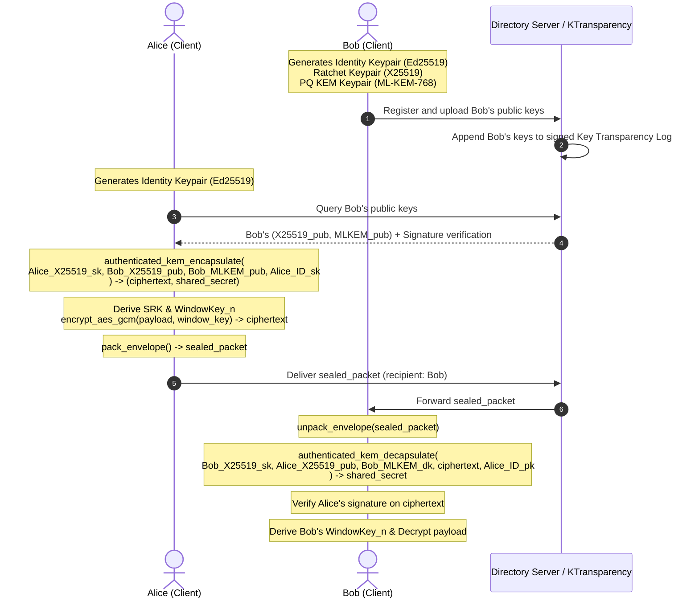

<div align="center">

# Vollcrypt Messages

**E2EE Message Encryption and Session Management module for Node.js, WebAssembly, and Rust**

[](https://www.npmjs.com/package/@vollcrypt/messages-node)
[](https://www.npmjs.com/package/@vollcrypt/messages-wasm)

</div>

---

This module contains the cryptographic primitives and session managers needed to build secure end-to-end encrypted (E2EE) messaging systems. It is compiled from a single Rust core to three targets: Node.js (native bindings), WebAssembly, and native Rust.

## Table of Contents

- [Installation](#installation)
- [Quick Start](#quick-start)
- [API Reference](#api-reference)
  - [Identity and Key Exchange](#identity-and-key-exchange)
  - [Post-Quantum Cryptography](#post-quantum-cryptography)
  - [Symmetric Encryption](#symmetric-encryption)
  - [Key Derivation](#key-derivation)
  - [Session Security (PCS Ratchet & Hashing)](#session-security)
  - [Sealed Sender](#sealed-sender)
  - [Key Verification Codes](#key-verification-codes)
  - [Key Transparency Log](#key-transparency-log)
  - [Device Registry](#device-registry)
- [Full E2EE Flow Example](#full-e2ee-flow-example)

---

## Installation

### Node.js (Server-side & Native Addon)

```bash
npm install @vollcrypt/messages-node
```

Prebuilt native binaries are provided for:
- Linux x64 (`linux-x64-gnu`)
- macOS x64 (`darwin-x64`)
- Windows x64 (`win32-x64-msvc`)

### WebAssembly (Browser / React / Next.js)

```bash
npm install @vollcrypt/messages-wasm
```

### Rust (Cargo)

In a Cargo workspace:
```toml
vollcrypt-core = { path = "../vollcrypt/src/core" }
```

---

## Quick Start

### Node.js — Generate Keys and Encrypt a Message

```ts
import {
  generateEd25519Keypair,
  encryptAesGcm,
  decryptAesGcm,
} from '@vollcrypt/messages-node';
import crypto from 'crypto';

// Identity keypair
const [identitySecret, identityPublic] = generateEd25519Keypair();

// Session key (in practice, derived via KEM handshake)
const sessionKey = crypto.randomBytes(32);
const plaintext  = Buffer.from('Hello, Vollcrypt');

// Encrypt
const ciphertext = encryptAesGcm(sessionKey, plaintext, null);

// Decrypt
const decrypted = decryptAesGcm(sessionKey, ciphertext, null);
console.log(decrypted.toString()); // Hello, Vollcrypt
```

### WebAssembly — Browser

```ts
import init, {
  generateEd25519Keypair,
  encryptAesGcm,
  decryptAesGcm,
} from '@vollcrypt/messages-wasm';

await init();

const [identitySecret, identityPublic] = generateEd25519Keypair();
const sessionKey = crypto.getRandomValues(new Uint8Array(32));
const plaintext  = new TextEncoder().encode('Hello, Vollcrypt');

const ciphertext = encryptAesGcm(sessionKey, plaintext, null);
const decrypted  = decryptAesGcm(sessionKey, ciphertext, null);
console.log(new TextDecoder().decode(decrypted));
```

---

## Architecture and Protocol Design

The Vollcrypt messages module provides the core cryptographic mechanisms to build end-to-end encrypted sessions between endpoints. The state machine enforces Perfect Forward Secrecy (PFS) through time-windowed ratchets, and Post-Compromise Security (PCS) through X25519 Diffie-Hellman ratcheting.

### E2EE Lifecycle Sequence Diagram



---

## API Reference

The APIs are exposed in both the Node.js native binding (`@vollcrypt/messages-node`) and the WebAssembly binding (`@vollcrypt/messages-wasm`). 

*   **JavaScript/TypeScript target types:** Both bindings expose the identical **camelCase** naming convention. In Node.js, functions accept/return `Buffer` (or `Uint8Array`), whereas in WASM, functions accept/return standard browser `Uint8Array` views.
*   **Rust target:** Native Rust developers should consume the `vollcrypt-core` crate directly, which exposes identical logic via **snake_case** functions.

---

### 1. Identity and Key Exchange

#### `generateEd25519Keypair() → [secretKey: Buffer, publicKey: Buffer]`
Generates a new Ed25519 keypair for user or device signing identity.
*   **Returns:** Array containing the `secretKey` (64 bytes) and `publicKey` (32 bytes).

#### `signMessage(secretKey: Uint8Array, message: Uint8Array) → Buffer`
Signs a message with an Ed25519 private key.
*   **Parameters:**
    *   `secretKey`: 64-byte Ed25519 private key buffer.
    *   `message`: Arbitrary binary buffer to sign.
*   **Returns:** 64-byte Ed25519 signature buffer.
*   **Errors:** Throws an exception if the secret key length is invalid.

#### `verifySignature(publicKey: Uint8Array, message: Uint8Array, signature: Uint8Array) → boolean`
Verifies an Ed25519 digital signature.
*   **Parameters:**
    *   `publicKey`: 32-byte Ed25519 public key.
    *   `message`: Signed payload.
    *   `signature`: 64-byte signature to verify.
*   **Returns:** `true` if the signature is valid; `false` otherwise.

#### `generateX25519Keypair() → [secretKey: Buffer, publicKey: Buffer]`
Generates a new X25519 Diffie-Hellman keypair for classical key exchange.
*   **Returns:** Array containing the X25519 `secretKey` (32 bytes) and `publicKey` (32 bytes).

#### `ecdhSharedSecret(ourSecret: Uint8Array, theirPublic: Uint8Array) → Buffer`
Computes an X25519 ECDH shared secret.
*   **Parameters:**
    *   `ourSecret`: 32-byte X25519 secret key.
    *   `theirPublic`: 32-byte X25519 public key.
*   **Returns:** 32-byte computed shared secret.
*   **Errors:** Throws if input lengths do not equal 32 bytes.

#### `generateMnemonic() → string`
Generates a new random English BIP-39 mnemonic phrase containing 24 words (256-bit entropy).
*   **Returns:** A 24-word string separated by spaces.

#### `mnemonicToSeed(phrase: string, password?: string | null) → Buffer`
Converts a BIP-39 mnemonic phrase to a 64-byte binary seed.
*   **Parameters:**
    *   `phrase`: The 24-word mnemonic string.
    *   `password`: Optional passphrase/password protection (salt) string.
*   **Returns:** 64-byte seed.
*   **Errors:** Throws if the mnemonic phrase is invalid or has a wrong checksum.

---

### 2. Post-Quantum Cryptography (PQC)

#### `mlKemKeygen() → [decapsKey: Buffer, encapsKey: Buffer]`
Generates a new ML-KEM-768 keypair (NIST FIPS 203).
*   **Returns:** Array containing the `decapsulationKey` (2400 bytes) and `encapsulationKey` (1184 bytes).

#### `mlKemEncapsulate(encapsulationKey: Uint8Array) → MlKemEncapsulationResult`
Performs ML-KEM-768 key encapsulation.
*   **Parameters:**
    *   `encapsulationKey`: 1184-byte ML-KEM public key.
*   **Returns:** Object with:
    *   `ciphertext`: Buffer (1088 bytes) to transmit.
    *   `sharedSecret`: Buffer (32 bytes) derived key.
*   **Errors:** Throws if the key size is incorrect.

#### `mlKemDecapsulate(decapsulationKey: Uint8Array, ciphertext: Uint8Array) → Buffer`
Decapsulates a KEM ciphertext to extract the shared secret.
*   **Parameters:**
    *   `decapsulationKey`: 2400-byte ML-KEM private key.
    *   `ciphertext`: 1088-byte encapsulated ciphertext.
*   **Returns:** 32-byte shared secret.
*   **Errors:** Throws if inputs are malformed.

#### `hybridKemEncapsulate(x25519OurSecret: Uint8Array, x25519TheirPublic: Uint8Array, mlKemEk: Uint8Array) → HybridKemResult`
Performs a hybrid KEM encapsulation combining X25519 and ML-KEM-768.
*   **Parameters:**
    *   `x25519OurSecret`: Alice's ephemeral 32-byte X25519 secret key.
    *   `x25519TheirPublic`: Bob's static 32-byte X25519 public key.
    *   `mlKemEk`: Bob's static 1184-byte ML-KEM encapsulation key.
*   **Returns:** Object with:
    *   `sharedKey`: Buffer (32 bytes) derived via HKDF-SHA256.
    *   `mlKemCiphertext`: Buffer (1088 bytes) KEM output.

#### `hybridKemDecapsulate(x25519OurSecret: Uint8Array, x25519TheirPublic: Uint8Array, mlKemDk: Uint8Array, mlKemCt: Uint8Array) → Buffer`
Decapsulates a hybrid KEM ciphertext.
*   **Parameters:**
    *   `x25519OurSecret`: Bob's static X25519 secret key.
    *   `x25519TheirPublic`: Alice's ephemeral X25519 public key.
    *   `mlKemDk`: Bob's static ML-KEM private key.
    *   `mlKemCt`: 1088-byte ML-KEM ciphertext.
*   **Returns:** 32-byte derived shared key.

#### `authenticatedKemEncapsulate(ourX25519Sk: Uint8Array, recipientX25519Pub: Uint8Array, recipientMlkemEk: Uint8Array, senderIdentitySk: Uint8Array) → [ciphertext: Buffer, sharedSecret: Buffer]`
Performs a hybrid KEM encapsulation and signs the ciphertext with the sender's Ed25519 identity key.
*   **Parameters:**
    *   `ourX25519Sk`: Sender's ephemeral X25519 secret key.
    *   `recipientX25519Pub`: Recipient's static X25519 public key.
    *   `recipientMlkemEk`: Recipient's static ML-KEM public key.
    *   `senderIdentitySk`: Sender's static Ed25519 signing secret key.
*   **Returns:** Array containing the signed KEM `ciphertext` (1154 bytes) and the `sharedSecret` (32 bytes).

#### `authenticatedKemDecapsulate(ourX25519Sk: Uint8Array, senderX25519Pub: Uint8Array, ourMlkemDk: Uint8Array, authenticatedCiphertext: Uint8Array, senderIdentityPk: Uint8Array) → Buffer`
Verifies the sender's signature before decapsulating the hybrid shared secret.
*   **Parameters:**
    *   `ourX25519Sk`: Bob's static X25519 secret key.
    *   `senderX25519Pub`: Alice's ephemeral X25519 public key.
    *   `ourMlkemDk`: Bob's static ML-KEM decapsulation key.
    *   `authenticatedCiphertext`: The signed KEM ciphertext.
    *   `senderIdentityPk`: Alice's static Ed25519 identity public key.
*   **Returns:** 32-byte shared secret.
*   **Errors:** Throws if the Ed25519 signature is invalid, refusing KEM negotiation.

---

### 3. Symmetric Encryption (AES-GCM)

All symmetric algorithms use AES-256-GCM. Nonces/IVs are 12 bytes and are generated internally using a cryptographically secure random number generator (`OsRng`).

#### `encryptAesGcm(key: Uint8Array, plaintext: Uint8Array, aad?: Uint8Array | null) → Buffer`
Encrypts payload. The internally generated 12-byte IV is prepended to the returned ciphertext.
*   **Parameters:**
    *   `key`: 32-byte encryption key.
    *   `plaintext`: Raw data to encrypt.
    *   `aad`: Optional Additional Authenticated Data.
*   **Returns:** Ciphertext buffer with a length of `12 + plaintext.length + 16` bytes.

#### `decryptAesGcm(key: Uint8Array, ciphertext: Uint8Array, aad?: Uint8Array | null) → Buffer`
Decrypts and validates an AES-GCM ciphertext. Assumes a prepended 12-byte IV.
*   **Parameters:**
    *   `key`: 32-byte encryption key.
    *   `ciphertext`: Ciphertext buffer (containing the 12-byte IV prepended).
    *   `aad`: Optional Additional Authenticated Data.
*   **Returns:** Decrypted plaintext.
*   **Errors:** Throws on key length errors or authentication tag mismatch (tampering).

#### `encryptAesGcmPadded(key: Uint8Array, plaintext: Uint8Array, aad?: Uint8Array | null) → Buffer`
Encrypts plaintext after padding it to standard boundaries (using PKCS#7 padding) to hide message size.

#### `decryptAesGcmPadded(key: Uint8Array, ciphertext: Uint8Array, aad?: Uint8Array | null) → Buffer`
Decrypts and removes PKCS#7 padding.

#### `encryptAesGcmChunked(key: Uint8Array, plaintext: Uint8Array, aad: Uint8Array | null, chunkSize: number) → Buffer`
Splits payload into multiple chunks of size `chunkSize` and encrypts each independently.

#### `decryptAesGcmChunked(key: Uint8Array, ciphertext: Uint8Array, aad?: Uint8Array | null) → Buffer`
Decrypts a chunked ciphertext stream.

#### `padMessage(content: Uint8Array) → Buffer`
Pads message data according to PKCS#7 standard block padding.

---

### 4. Key Derivation and Wrapping

#### `derivePbkdf2(password: Uint8Array, salt: Uint8Array, iterations: number, keyLen: number) → Buffer`
Derives a key from a password using PBKDF2-SHA256.
*   **Security Policy:** Always use at least **600,000 iterations** for password-based key wrapping.

#### `deriveHkdf(ikm: Uint8Array, salt: Uint8Array | null, info: Uint8Array | null, keyLen: number) → Buffer`
Derives a cryptographically strong key from input keying material (IKM) using HKDF-SHA256.

#### `deriveSrk(dek: Uint8Array, chatId: Uint8Array) → Buffer`
Derives a 32-byte Session Root Key (SRK) from a Data Encryption Key (DEK) and a unique chat identifier.

#### `deriveWindowKey(srk: Uint8Array, windowIndex: number) → Buffer`
Derives a time-window-specific encryption key from the Session Root Key.
*   `windowIndex`: `floor(UNIX_timestamp / window_size_seconds)`.

#### `wrapKey(kek: Uint8Array, keyToWrap: Uint8Array) → Buffer`
Wraps a key using AES-256 Key Wrap (AES-KW, RFC 3394) under a Key Encryption Key (KEK).
*   **Errors:** Throws if input lengths are invalid.

#### `unwrapKey(kek: Uint8Array, wrappedKey: Uint8Array) → Buffer`
Unwraps an AES-KW wrapped key.

---

### 5. Session Security & Ratcheting

#### `generateRatchetKeypair() → [secretKey: Buffer, publicKey: Buffer]`
Generates a new ephemeral X25519 keypair for Post-Compromise Security (PCS) ratcheting steps.

#### `ratchetSrk(currentSrk: Uint8Array, ourRatchetSecret: Uint8Array, theirRatchetPub: Uint8Array, chatId: Uint8Array, ratchetStep: number, isSender: boolean) → Buffer`
Advances the Session Root Key (SRK) with an ephemeral ECDH exchange value.
*   **Parameters:**
    *   `currentSrk`: Current 32-byte Session Root Key.
    *   `ourRatchetSecret`: Our ephemeral 32-byte X25519 secret key.
    *   `theirRatchetPub`: Their ephemeral X25519 public key.
    *   `chatId`: Unique conversation identifier.
    *   `ratchetStep`: Monotonic counter representing the ratchet step.
    *   `isSender`: True if computing as the sender of the ratcheted message.
*   **Returns:** 32-byte newly derived SRK. Old SRK must be zeroed immediately.

#### `shouldRatchet(messageCount: number, windowChanged: boolean, messagesPerRatchet: number, ratchetOnNewWindow: boolean) → boolean`
Utility logic to check if the client is due to rotate keys.

---

### 6. Transcript Hashing

Transcript hashing provides replay, deletion, and out-of-order message insertion detection by linking each message to the historical chain hash state.

#### `transcriptNew(sessionId: Uint8Array) → Buffer`
Initializes a new transcript chain state.
*   **Returns:** 32-byte initial chain hash (`SHA-256(sessionId)`).

#### `transcriptComputeMessageHash(messageId: Uint8Array, senderId: Uint8Array, timestamp: number, ciphertext: Uint8Array) → Buffer`
Computes the SHA-256 hash of a message envelope.
*   **Returns:** 32-byte message hash.

#### `transcriptUpdate(chainState: Uint8Array, messageHash: Uint8Array) → Buffer`
Updates the running chain state.
*   `new_chain = SHA-256(old_chain || messageHash)`.

#### `transcriptVerifySync(hashA: Uint8Array, hashB: Uint8Array) → boolean`
Verifies whether two transcript hashes match using a constant-time comparison.

---

### 7. Sealed Sender

#### `sealMessage(recipientX25519Pub: Uint8Array, senderId: Uint8Array, content: Uint8Array) → Buffer`
Encrypts the sender's identity together with the content under an ephemeral ECDH key, hiding sender metadata from routing servers.

#### `unsealMessage(sealedPacket: Uint8Array, ourX25519Sk: Uint8Array) → [senderId: Buffer, content: Buffer]`
Decrypts a sealed sender packet.

---

### 8. Key Verification Codes

#### `generateVerificationCode(keyA: Uint8Array, keyB: Uint8Array, conversationId: Uint8Array) → string`
Generates a JSON string containing out-of-band verification codes (both formatted decimal groups and emoji sequences) for human comparison.

---

### 9. Key Transparency Log

#### `keyLogCreateEntry(userId: Uint8Array, publicKey: Uint8Array, timestamp: number, prevEntryHash: Uint8Array, action: number, signingKey: Uint8Array) → string (json)`
Generates and signs a Key Transparency append-only log entry.

#### `keyLogVerifyChain(entriesJson: string) → boolean`
Verifies the integrity, signature sequence, and linkage of a JSON array of Key Transparency log entries.

---

### 10. Device Registry

#### `registryEmpty() → string (json)`
Returns an empty device registry state object.

#### `registryAddDevice(registryJson: string, deviceId: string, name: string, addedAt: number, publicKey: string) → string (json)`
Adds a device public key to the registry JSON string.

#### `registryRevokeDevice(registryJson: string, deviceId: string) → string (json)`
Revokes a device by its ID.

---

## Full E2EE Flow Example

This script illustrates the complete cryptographic pipeline for generating keys, performing the Hybrid KEM handshake, deriving keys, encrypting a message via Sealed Sender, updating transcripts, and decrypting the result.

```ts
import {
  generateEd25519Keypair,
  generateX25519Keypair,
  generateMlKem768Keypair,
  authenticatedKemEncapsulate,
  authenticatedKemDecapsulate,
  deriveSrk,
  deriveWindowKey,
  transcriptNew,
  transcriptComputeMessageHash,
  transcriptUpdate,
  transcriptVerifySync,
  encryptAesGcm,
  decryptAesGcm,
  sealMessage,
  unsealMessage
} from '@vollcrypt/messages-node';

// 1. Participant Identity Keypair Generation
const [aliceIdSk, aliceIdPk] = generateEd25519Keypair();
const [aliceX25519Sk, aliceX25519Pk] = generateX25519Keypair();
const [aliceMlkemDecaps, aliceMlkemEncaps] = generateMlKem768Keypair(); // [decaps, encaps]

const [bobIdSk, bobIdPk] = generateEd25519Keypair();
const [bobX25519Sk, bobX25519Pk] = generateX25519Keypair();
const [bobMlkemDecaps, bobMlkemEncaps] = generateMlKem768Keypair();

// 2. Hybrid Handshake Execution
const conversationId = Buffer.from('conv-alice-bob-001');

// Alice generates an ephemeral X25519 keypair for the hybrid KEM
const [aliceEphSk, aliceEphPk] = generateX25519Keypair();

// Alice encapsulates key material for Bob
const [authCiphertext, aliceSharedSecret] = authenticatedKemEncapsulate(
  aliceEphSk,      // Alice's ephemeral X25519 secret
  bobX25519Pk,     // Bob's static X25519 public key
  bobMlkemEncaps,  // Bob's static ML-KEM encapsulation key
  aliceIdSk        // Alice's signing key (for authentication)
);

// Bob receives Alice's ephemeral public key (extracted from handshake metadata or sent alongside)
// and decapsulates the shared secret
const bobSharedSecret = authenticatedKemDecapsulate(
  bobX25519Sk,      // Bob's static X25519 secret key
  aliceEphPk,       // Alice's ephemeral X25519 public key
  bobMlkemDecaps,   // Bob's static ML-KEM decapsulation key
  authCiphertext,   // The signed KEM ciphertext envelope
  aliceIdPk         // Alice's static Ed25519 public key
);

// 3. Key Derivation (SRK & Window Keys)
const aliceSrk = deriveSrk(aliceSharedSecret, conversationId);
const bobSrk   = deriveSrk(bobSharedSecret, conversationId);

const windowIndex = Math.floor(Date.now() / 1000 / 3600);
const aliceWindowKey = deriveWindowKey(aliceSrk, windowIndex);
const bobWindowKey   = deriveWindowKey(bobSrk, windowIndex);

// 4. Transcript Initialization
let aliceChain = transcriptNew(conversationId);
let bobChain   = transcriptNew(conversationId);

// 5. Encrypting & Sealing the Message (Alice)
const messageId = Buffer.from('msg-001');
const senderId  = Buffer.from('alice@example.com');
const timestamp = Math.floor(Date.now() / 1000);
const aad       = Buffer.concat([messageId, senderId, Buffer.from(timestamp.toString())]);
const plaintext = Buffer.from('Hello Bob');

const ciphertext = encryptAesGcm(aliceWindowKey, plaintext, aad);
const sealed     = sealMessage(bobX25519Pk, senderId, ciphertext);

// Update Alice's Transcript chain hash state
const msgHash = transcriptComputeMessageHash(messageId, senderId, timestamp, ciphertext);
aliceChain    = transcriptUpdate(aliceChain, msgHash);

// 6. Unsealing & Decrypting the Message (Bob)
const [revealedSender, revealedCiphertext] = unsealMessage(sealed, bobX25519Sk);
const decrypted = decryptAesGcm(bobWindowKey, revealedCiphertext, aad);

// Update Bob's Transcript chain hash state
bobChain = transcriptUpdate(bobChain, msgHash);

// 7. Verify Integrity and Equivalence
console.log(decrypted.toString());                       // "Hello Bob"
console.log(transcriptVerifySync(aliceChain, bobChain)); // true
```

---

## Secure Client Integration Guidelines

When integrating `@vollcrypt/messages-node` or `@vollcrypt/messages-wasm` inside client applications, you must obey the following cryptographic safety mandates:

### 1. Active Memory Zeroization
JavaScript runtimes do not automatically clear memory and are vulnerable to garbage-collection delays, which leaves raw keys exposed in memory.
*   **Clear buffers immediately after use:** Overwrite raw sensitive private keys or derived keys using `TypedArray.prototype.fill(0)`.
```ts
// Example: Zeroizing KEK or salt buffers in JS
const rawKey = new Uint8Array([/* secret bytes */]);
try {
  // perform cryptographic operation...
} finally {
  rawKey.fill(0); // Safely scrubs key from memory
}
```

### 2. Leverage Non-Extractable CryptoKeys (Web Crypto API)
Never store raw public/private keys in plaintext inside Javascript context variables or state trees.
*   When receiving raw key buffers from the WebAssembly module, immediately import them into browser-native `SubtleCrypto` with `extractable: false`.
*   Scrub the original WASM-returned buffer immediately afterwards.
```ts
const rawWasmKey = ...; // Uint8Array
const cryptoKey = await window.crypto.subtle.importKey(
  "raw",
  rawWasmKey.buffer,
  { name: "AES-GCM" },
  false, // extractable = false prevents programmatic reading via XSS
  ["encrypt", "decrypt"]
);
rawWasmKey.fill(0); // Zeroize the raw buffer
```

### 3. Avoid Persistent Insecure Storage
*   **Never** write raw secrets, seeds, or unencrypted keys to `localStorage`, `sessionStorage`, or cookies.
*   Always wrap keys using `wrapKey()` (AES-256-KW) with a key encryption key (KEK) derived via `derivePbkdf2()` (with at least 600,000 iterations) from a user master password before writing to `IndexedDB` or local disk.

