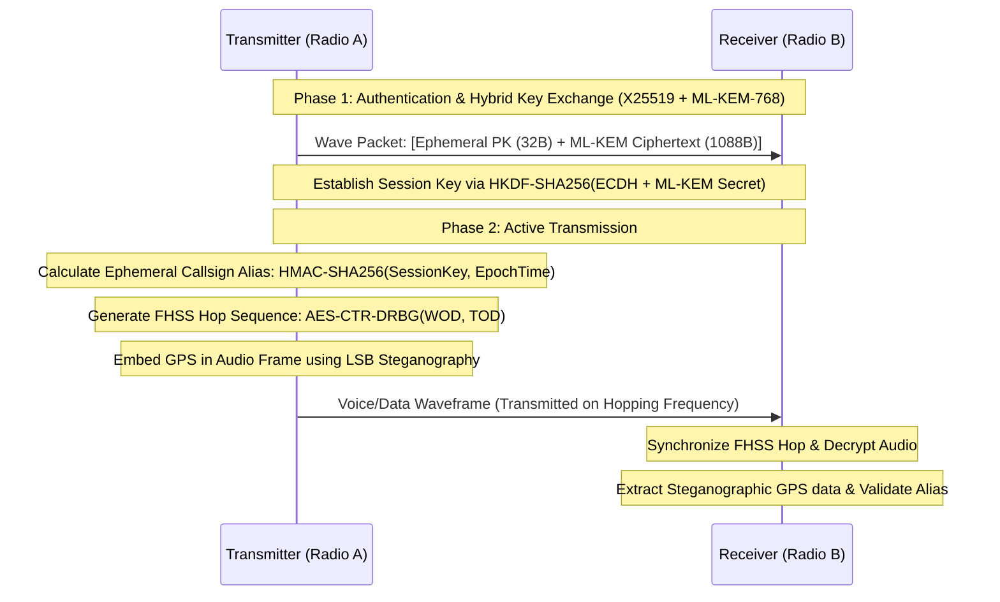

<div align="center">
  <h1>Vollcrypt Wave</h1>
  <p><strong>Tactical Radio COMSEC & TRANSEC Protocol for Military & Covert Communication</strong></p>
  
  <p>
    <a href="https://csrc.nist.gov/pubs/fips/203/final">
      
    </a>
    
    
  </p>
</div>

---

**Vollcrypt Wave** is a self-contained, independent military-grade cryptographic protocol designed specifically for tactical radio communications (HF, VHF, UHF bands). Operating under zero-trust, low-bandwidth, and high-noise environments, it combines robust Transmission Security (TRANSEC) and Communications Security (COMSEC) features to protect tactical nets against jamming, interception, and direction-finding metadata tracking.

Unlike `vollcrypt-messages`, **Vollcrypt Wave** is fully independent and implements its own standalone cryptographic flow to meet strict low-overhead and high-resilience requirements of tactical digital and software-defined radios (SDR).

---

## Key Features

1.  **Independent Cryptographic Core**: Self-contained cryptographic implementation utilizing modern primitives (`x25519-dalek`, `ml-kem`, `aes-gcm`, `hkdf`, `sha2`) without depending on external Vollcrypt modules.
2.  **Quantum-Resistant Hybrid Key Exchange**: Combines **ML-KEM-768** (FIPS 203) and **X25519** ECDH via HKDF-SHA256 to ensure that tactical networks resist both classical and future quantum-based decryption attacks.
3.  **Cryptographic Frequency Hopping (FHSS)**: Generates deterministic pseudo-random frequency hopping channels based on a shared **Word of Day (WOD)** and high-precision **Time of Day (TOD)**, mimicking white noise patterns.
4.  **Dynamic Ephemeral Aliasing (Frekans Alias)**: Completely hides physical subscriber and radio IDs over-the-air. Radios dynamically derive call sign pseudonyms (aliases) using time-rotating HMAC keys. Additionally, the encrypted frame envelope can contain an optional `target_logical_freq` parameter, directing receiving transceivers to instantly switch physical frequencies upon packet decryption.
5.  **Steganography (LSB & DSSS Noise Floor)**:
    *   *Audio Steganography (LSB):* Embeds data (e.g., GPS coordinates) in the least significant bits of 16-bit PCM voice frames.
    *   *Sinyal Gürültü Altına Gömme (DSSS):* Implements LPI/LPD (Low Probability of Intercept/Detection) by spreading bits over a 256-chip pseudo-random noise sequence. This buries the signal deep inside the noise floor, which can only be decoded by authorized receivers possessing the shared cryptographic key.
6.  **Frequency Formatting & Modulation (Carrier Hopping)**: Maps channel indices to physical RF bands (e.g., VHF 30-88 MHz with 25 kHz spacing) and encodes data bits to modulation-ready FSK symbols. Implements **Time-Synchronized Hopping Switching** (Zaman Senkronize Atlamalı Anahtarlama), where data blocks are dynamically packaged onto shifting carrier frequencies at the SDR level to bypass physical antenna tuning limitations.
7.  **TOD Time Synchronization**: Implements a secure time exchange protocol with HMAC-SHA256 authenticity verification and exponential clock drift correction to keep FHSS channels locked in phase.
8.  **Adaptive Audio Compression (4-bit Codec)**: Incorporates an integrated IMA ADPCM voice compressor that reduces 16-bit PCM voice streams by 4:1 (25% size) to fit narrow tactical radio bandwidths.
9.  **Tactical Mesh Routing**: Employs an ad-hoc packet router that routes data across intermediate nodes using hop-limit budgets and duplicate packet suppression to avoid loop storms.
10. **Wave-TCP Lossless Delivery Layer**: Provides a reliable sliding-window ARQ (Automatic Repeat reQuest) transport layer that splits payloads into small radio-friendly segments, tracking sequence ACKs and retransmitting lost packets to guarantee 100% lossless delivery over noisy RF links.

---

## Architectural Workflow



---

## Directory Structure

*   `src/lib.rs`: Exposes the main modules and entry points for the protocol.
*   `src/fhss.rs`: Implements the cryptographic frequency hopping sequence generator based on TOD and WOD parameters.
*   `src/alias.rs`: Handles the generation and validation of ephemeral cryptographic aliases.
*   `src/stego.rs`: Provides audio steganography capabilities, embedding digital bits into voice frames.
*   `src/wave_packet.rs`: Defines the low-overhead, highly compact frame structure required for radio channels.
*   `src/modulation.rs`: Maps channel indices to physical RF bands and handles FSK modulation symbol formatting.
*   `src/sync.rs`: Implements secure TOD time synchronization with HMAC authentication.
*   `src/codec.rs`: Provides the integrated 4-bit ADPCM voice audio compression/decompression codec.
*   `src/routing.rs`: Manages ad-hoc mesh routing and duplicate packet suppression.
*   `src/wave_tcp.rs`: Implements the reliable ARQ packet retransmission and reassembly layer.

---

## Quick Start (Rust API)

### 1. Generating an Ephemeral Alias
```rust
use vollcrypt_wave::alias::EphemeralAlias;

let session_key = [0u8; 32];
let current_epoch_seconds = 1718974500u64;

// Generate transient callsig alias
let alias = EphemeralAlias::generate(&session_key, current_epoch_seconds);
println!("Current dynamic alias: {:?}", alias.to_u32());
```

### 2. Computing next Frequency Hop
```rust
use vollcrypt_wave::fhss::FhssGenerator;

let word_of_day = [0u8; 32];
let time_of_day_ms = 1718974500123u64;
let frequency_channels = 80; // Total 80 hopping channels

let mut fhss = FhssGenerator::new(word_of_day, frequency_channels);
let target_channel = fhss.next_hop(time_of_day_ms);
println!("Tune radio to channel: {}", target_channel);
```

### 3. Hiding Data inside Digitized Audio
```rust
use vollcrypt_wave::stego::AudioSteganographer;

let mut audio_samples: Vec<i16> = vec![0; 1000]; // Digitized voice stream
let secret_gps_data = b"39.9334-32.8597"; // Coordinates to hide

// Embed data
let bits_written = AudioSteganographer::embed(&mut audio_samples, secret_gps_data).unwrap();

// Extract data on receiver
let extracted_data = AudioSteganographer::extract(&audio_samples).unwrap();
assert_eq!(extracted_data, secret_gps_data);
```

---

## Security & Physical Specifications

| Layer | Primitive / Mechanism | Purpose |
| :--- | :--- | :--- |
| **COMSEC (KEM)** | ML-KEM-768 + X25519 | Quantum-resistant asymmetric key exchange |
| **COMSEC (Sym)** | AES-256-GCM | Encrypted payload integrity & confidentiality |
| **TRANSEC (FHSS)** | AES-128-CTR / AES-256 | Pseudo-random hop sequence generator |
| **TRANSEC (Stego)** | LSB & 256-Chip DSSS | Covert audio steganography & noise floor signal hiding (LPI/LPD) |
| **TRANSEC (Alias)** | HMAC-SHA256 | Ephemeral call signs and logical channel header transitions |
| **TRANSEC (GPS Sync)**| `TimeSynchronizer` GPS Lock | Bypasses software clock drift smoothing when atomic clock/GPS locks are available |
| **PHYSICAL (Synthesizer)** | PLL Hopping Guard Bands | Restricts consecutive carrier jumps (`max_hop_delta_hz`) to allow PLL loop lock |
| **PHYSICAL (Limits)** | Min/Max Frequency checks | HardwareConfig checks that prevent commands exceeding physical antenna specifications |

---

## Independent Publishing

The `vollcrypt-wave` crate is designed to be built, tested, and published completely independently of the rest of the workspace modules. 

To publish the crate to **crates.io** manually:
1. Navigate to the `vollcrypt-wave` directory:
   ```bash
   cd vollcrypt-wave
   ```
2. Verify formatting and compile the code:
   ```bash
   cargo fmt --check
   cargo clippy -- -D warnings
   ```
3. Run all unit tests to ensure stability:
   ```bash
   cargo test
   ```
4. Verify the package structure and generate the package file:
   ```bash
   cargo package
   ```
5. Publish the package:
   ```bash
   cargo publish
   ```


