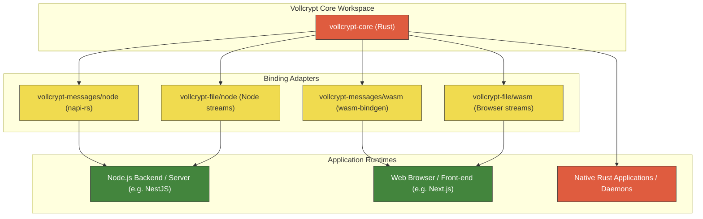

<div align="center">

# Vollcrypt

**Cross-platform, quantum-resistant cryptography workspace for Node.js, WebAssembly, and Rust**

[](https://github.com/BeratVural/vollcrypt/actions/workflows/ci.yml)
[](LICENSE)
[](https://csrc.nist.gov/pubs/fips/203/final)

</div>

---

Vollcrypt is a cryptographic library providing secure building blocks for end-to-end encrypted (E2EE) messaging systems and file transfer/storage tools. The core library is written in Rust and compiled to Node.js native bindings, WebAssembly, and native Rust.

## Documentation Modules

Explore the specific modules of Vollcrypt:

*   📩 **[Vollcrypt Messages Module Documentation (README-messages.md)](README-messages.md)** - Stable, E2EE messaging session managers, PCS ratchets, sealed sender, and transparency logs.
*   📁 **[Vollcrypt Files Module Documentation (README-files.md)](README-files.md)** - Active Development, streaming chunk-based encryption, and Merkle tree verification.

---

## Repository Structure

This repository is organized as a monorepo containing the following modules:

*   `vollcrypt-messages/`: The Rust implementation and bindings for E2EE messaging (Node.js and WebAssembly).
*   `vollcrypt-file/`: The Rust implementation and core logic for E2EE file/stream chunking and verification.



---

## Security Properties

| Property | Applied To | Mechanism | Guarantee / Protection |
| :--- | :--- | :--- | :--- |
| **Confidentiality** | Messages & Files | AES-256-GCM | Encrypted content cannot be read without the session/file key. Files are encrypted in chunk streams. |
| **Integrity** | Messages | AES-256-GCM tag + Transcript Hash Chain | Messages cannot be modified, reordered, replayed, or deleted without detection. |
| **Integrity** | Files | Merkle Tree over chunk authentication tags | Individual chunks cannot be swapped, reordered, or deleted. Allows verification of individual chunks without full download. |
| **Forward Secrecy** | Messages | Time-windowed WindowKey (HKDF) | Compromising a current key does not expose past session messages. |
| **Post-Compromise Security** | Messages | Ephemeral X25519 PCS ratchet | Session recovers automatically from key compromise within a few messages. |
| **Quantum Resistance** | Messages & Files | X25519 + ML-KEM-768 Hybrid KEM | Session/file key exchange resists both classical and quantum attacks. |
| **Sender Authenticity** | Messages & Files | Ed25519 signature on KEM ciphertext/metadata | Recipients can verify the authenticity of the sender and prevent MITM key substitution by the server. |
| **Sender Privacy** | Messages | Sealed Sender (ECDH + AES-GCM) | The server routes messages without knowing the sender's identity. |
| **Key Auditability** | Messages | Key Transparency log (signed hash chain) | Key modifications are append-only and public, preventing silent backdating of keys. |
| **MITM Detection** | Messages | Out-of-band Verification Codes (Numeric/Emoji) | Humans can easily verify the fingerprint of their keys to ensure no MITM is present. |
| **Password Derivation** | Messages & Files | PBKDF2 (600k iterations) & Argon2id (files only) | Derives high-entropy wrapping keys from user passwords to secure recovery seeds and keys. |
| **Key Wrapping** | Messages & Files | AES-256-KW (RFC 3394) | Protects sensitive keys (DEK, SRK, Mnemonics) when stored in insecure local storage. |

---

## Feature Support Matrix

| Feature | Messages Module (`vollcrypt-messages`) | Files Module (`vollcrypt-file`) | Maturity Level | Primary Use Case |
| :--- | :--- | :--- | :--- | :--- |
| **Symmetric Cipher** | AES-256-GCM | AES-256-GCM | Production-ready (Messages) / Beta (Files) | Bulk payload encryption |
| **Classical Key Exchange** | X25519 ECDH | X25519 ECDH | Production-ready | Classical forward-secure key exchanges |
| **Post-Quantum KEM** | ML-KEM-768 | ML-KEM-768 | Production-ready (FIPS 203) | Quantum-resistant session setup |
| **Hybrid Key Transport** | Yes (X25519 + ML-KEM) | Yes (X25519 + ML-KEM) | Production-ready | Forward-secure, PQ-secure handshakes |
| **Digital Signatures** | Ed25519 | Ed25519 | Production-ready | Key log entries, ciphertext authenticity |
| **Password Derivation** | PBKDF2-SHA256 (600k) | PBKDF2-SHA256 (600k) & Argon2id | Production-ready | Local database / seed wrapping |
| **Key Wrapping** | AES-256-KW (RFC 3394) | AES-256-KW (RFC 3394) | Production-ready | Secure key storage at rest |
| **Integrity Verification** | Transcript Hash Chain | Merkle Tree over Chunk Tags | Production-ready (Messages) / Beta (Files) | Reordering protection (Messages) / Random access seek validation (Files) |
| **Group Support** | - | Signed Group Manifest Log | Beta | Multi-recipient file sharing/rotation |
| **Maturity** | **Stable** | **Active Development** | - | - |

---

## Building From Source

### Prerequisites

You must have Rust, Node.js, and compiler tools set up on your machine. Depending on your Operating System, additional libraries are required:

| Tool | Version | OS Requirements / Configuration | Purpose |
| :--- | :--- | :--- | :--- |
| **Rust** | Stable (≥ 1.76) | Standard target setup. Run `rustup target add wasm32-unknown-unknown` for WASM. | Core compilation and library code |
| **wasm-pack** | Latest | Available globally via binary or npm package. | Compiles Rust core to Browser WASM package |
| **Node.js** | ≥ 18 | LTS release recommended. | Native addon execution environment |
| **npm** | ≥ 9 | Packaged with Node.js. | Node package dependencies |
| **C/C++ Build Tools** | Current | **Windows:** Visual Studio C++ Build Tools.<br>**macOS:** Xcode Command Line Tools (`xcode-select --install`).<br>**Linux:** GCC/G++ (`build-essential`). | Compiling native node bindings |
| **LLVM / Clang** | Latest | Required by binding generators. Add `LIBCLANG_PATH` environment variable pointing to LLVM bin folder if missing. | Header parsing for `napi-rs` |

### Compilation Steps

```bash
# Clone the repository
git clone https://github.com/BeratVural/vollcrypt.git
cd vollcrypt

# 1. Run all workspace Rust tests
cargo test --workspace

# 2. Format and Lint checks
cargo fmt --all -- --check
cargo clippy --workspace -- -D warnings

# 3. Build Node.js Native Addon for Messages
cd vollcrypt-messages/node
npm install
npm run build
cd ../..

# 4. Build WebAssembly target for Messages
cd vollcrypt-messages/wasm
wasm-pack build --target web --out-dir pkg
cd ../..
```

### Troubleshooting Common Build Issues

*   **Error: `ClangNotFound` or `could not find libclang`**
    *   *Cause:* The Rust package generator cannot locate Clang for parsing headers.
    *   *Resolution:* 
        *   **Windows:** Install LLVM via winget: `winget install LLVM.LLVM` or chocolatey: `choco install llvm`. Then add a system environment variable `LIBCLANG_PATH` pointing to the directory containing `libclang.dll` (typically `C:\Program Files\LLVM\bin`).
        *   **macOS:** Install Xcode Command Line Tools. Clang is bundled.
        *   **Linux:** Install clang and development headers: `sudo apt-get install clang libclang-dev` (Ubuntu/Debian) or `sudo dnf install clang clang-devel` (Fedora).
*   **Error: `wasm-pack target directory locked`**
    *   *Cause:* Concurrent builds or crashed builds holding the compiler lock file.
    *   *Resolution:* Run `cargo clean` in the root workspace folder to clear target lock files, then rerun the `wasm-pack` command.
*   **Error: `MSB4019: The imported project ... was not found`**
    *   *Cause:* Visual Studio build tools are missing or not properly configured for Node native module generation on Windows.
    *   *Resolution:* Run a powershell instance as administrator and install desktop build tools: `npm install --global --production windows-build-tools` or install manually via Visual Studio Installer.

---

## Licensing

Vollcrypt is licensed under the GPL-3.0 License. See the [LICENSE](LICENSE) file for details.
