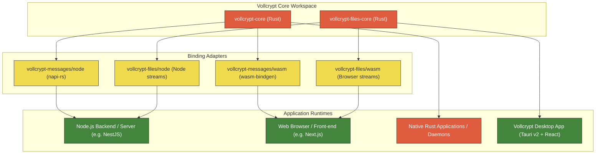

<div align="center">
  <h1>
    <strong>VOLL</strong><span style="font-family: 'Brush Script MT', 'Lucida Handwriting', 'Segoe Script', cursive; color: #ff7a00; font-weight: normal; font-size: 1.1em; margin-left: -2px; display: inline-block;">crypt</span>
  </h1>
  
  <p><strong>Cross-platform, quantum-resistant cryptography workspace for Node.js, WebAssembly, and Rust</strong></p>
  
  <p>
    <a href="https://github.com/BeratVural/vollcrypt/actions/workflows/ci.yml">
      
    </a>
    <a href="LICENSE-GPL">
      
    </a>
    <a href="LICENSE-COMMERCIAL.md">
      
    </a>
    <a href="https://csrc.nist.gov/pubs/fips/203/final">
      
    </a>
  </p>
</div>
---

Vollcrypt is a cryptographic library providing secure building blocks for end-to-end encrypted (E2EE) messaging systems and file transfer/storage tools. The core library is written in Rust and compiled to Node.js native bindings, WebAssembly, and native Rust.

## Documentation Modules

Explore the specific modules of Vollcrypt:

*    **[Vollcrypt Messages Module Documentation (README-messages.md)](README-messages.md)** - Stable, E2EE messaging session managers, PCS ratchets, sealed sender, and transparency logs.
*    **[Vollcrypt Files Module Documentation (README-files.md)](README-files.md)** - Active Development, streaming chunk-based encryption, and Merkle tree verification.
*    **[Vollcrypt Desktop App Module Documentation (README-desktop.md)](README-desktop.md)** - Frameless, dark-mode native desktop application for file and text cryptography.
*    **[Vollcrypt DB-Guard Module Documentation (README-db-guard.md)](README-db-guard.md)** - FIPS-compliant database field-level encryption integrations (Prisma, Mongoose, Drizzle, TypeORM, Diesel, SeaORM) with dynamic KMS routing and PKCS#11 HSM support.
*    **[Vollcrypt DB-Proxy Module Documentation (README-db-proxy.md)](README-db-proxy.md)** - Zero-trust database protocol proxy (PostgreSQL) executing dynamic envelope decryption and dynamic data masking (DDM) on-the-fly for off-the-shelf BI tools and SQL clients.
*    **[Vollcrypt Wave Module Documentation (README-wave.md)](README-wave.md)** - Standalone, `#![no_std]` zero-allocation tactical radio COMSEC & TRANSEC protocol with deterministic chaos FHSS, dynamic aliasing, and Doppler sync.

---

## Repository Structure

This repository is organized as a monorepo containing the following modules:

*   `vollcrypt-messages/`: The Rust implementation and bindings for E2EE messaging (Node.js and WebAssembly).
*   `vollcrypt-files/`: The Rust implementation and core logic for E2EE file/stream chunking and verification.
*   `vollcrypt-desktop/`: Cross-platform desktop application built with Tauri (Rust) and React + Vanilla CSS.
*   `db-guard/`: FIPS-compliant database field-level encryption adapters for Node.js ORMs and Rust ORMs.
*   `db-proxy/`: A database wire-protocol proxy for transparent field decryption and masking in-transit.



---

## Core Capabilities & Cryptographic Guarantees

Vollcrypt workspace exposes a unified suite of quantum-resistant cryptographic engines, application-level clients, and transparent database security proxies:

1. **Quantum-Resistant End-to-End Encryption (E2EE)**
   Secures messaging sessions and file distribution pipelines against both current and future quantum computing threats.
   * **Hybrid Key Encapsulation:** Combines FIPS 203 **ML-KEM-768** with classical **X25519** ECDH.
   * **PCS & Forward Secrecy:** Continuous ephemeral key ratcheting isolates key compromise and secures historical archives.
   * **Sender & Receiver Privacy:** Zero-knowledge Sealed Sender routing hides message metadata from delivery servers, and Blind Cluster Multicast hides recipient destinations.

2. **Transparent Database & Zero-Trust Security**
   Protects sensitive database records directly at-rest and in-transit without modifications to off-the-shelf software.
   * **Field-Level Encryption (DB-Guard):** Modular ORM adapters (Drizzle, Mongoose, SeaORM, etc.) with dynamic KMS routing.
   * **Zero-Trust Wire Proxy (DB-Proxy):** Transparently decrypts and masks PostgreSQL fields on-the-fly for business intelligence tools and SQL clients.

3. **High-Performance Desktop Cryptography**
   Provides a cross-platform, native desktop application (Tauri v2 + React) designed to encrypt local files and text.
   * **Stream Chunking & Verification:** Encrypts large files in chunks and validates integrity using Merkle trees without fully downloading the file.

4. **Tactical & Covert Radio TRANSEC/COMSEC (Vollcrypt Wave)**
   A `#![no_std]` bare-metal compatible library designed to secure digital and software-defined radios (SDR) under extreme noise and jamming environments.
   * **Chaotic Frequency Hopping (FHSS):** Non-linear dynamical chaos systems (Logistic Map / Lorenz Attractors) generate hopping sequences indistinguishable from background noise.
   * **Anti-Jamming & Acoustic Fallback:** Dynamically escapes jamming frequencies via emergency hopping or autonomous ultrasonic fallback.
   * **Hardware Abstraction Layer (HAL):** Decouples radio front-end drivers (Aselsan, Harris, SDR) from the cryptography engine.

5. **Anti-Tamper & Sovereign Control**
   Establishes physical and logical guardrails for hardware devices.
   * **Poison Pill Zeroization:** Wipes key material and permanently locks compromised devices via Ed25519-signed OTAZ commands.
   * **Reactive Hardware Wiping:** Triggered automatically upon case intrusion or debugger JTAG connection detection.

---

## Building From Source

### Prerequisites

You must have Rust, Node.js, and compiler tools set up on your machine. Depending on your Operating System, additional libraries are required:

| Tool | Version | OS Requirements / Configuration | Purpose |
| :--- | :--- | :--- | :--- |
| **Rust** | Stable (≥ 1.76) | Standard target setup. Run `rustup target add wasm32-unknown-unknown` for WASM. | Core compilation and library code |
| **wasm-pack** | Latest | Available globally via binary or npm package. | Compiles Rust core to Browser WASM package |
| **Node.js** | ≥ 18 | LTS release recommended. | Native addon execution environment |
| **npm** | ≥ 9 | Packaged with Node.js. | Node package dependencies |
| **C/C++ Build Tools** | Current | **Windows:** Visual Studio C++ Build Tools.<br>**macOS:** Xcode Command Line Tools (`xcode-select --install`).<br>**Linux:** GCC/G++ (`build-essential`). | Compiling native node bindings |
| **LLVM / Clang** | Latest | Required by binding generators. Add `LIBCLANG_PATH` environment variable pointing to LLVM bin folder if missing. | Header parsing for `napi-rs` |

### Compilation Steps

```bash
# Clone the repository
git clone https://github.com/BeratVural/vollcrypt.git
cd vollcrypt

# 1. Run all workspace Rust tests
cargo test --workspace

# 2. Format and Lint checks
cargo fmt --all -- --check
cargo clippy --workspace -- -D warnings

# 3. Build Node.js Native Addon for Messages
cd vollcrypt-messages/node
npm install
npm run build
cd ../..

# 4. Build WebAssembly target for Messages
cd vollcrypt-messages/wasm
wasm-pack build --target web --out-dir pkg
cd ../..

# 5. Build and Run Vollcrypt Desktop Application
cd vollcrypt-desktop
npm install
npm run tauri dev      # Launches developer dev server
npm run tauri build    # Packages optimized production installer (.msi/.exe)
cd ..
```

### Troubleshooting Common Build Issues

*   **Error: `ClangNotFound` or `could not find libclang`**
    *   *Cause:* The Rust package generator cannot locate Clang for parsing headers.
    *   *Resolution:* 
        *   **Windows:** Install LLVM via winget: `winget install LLVM.LLVM` or chocolatey: `choco install llvm`. Then add a system environment variable `LIBCLANG_PATH` pointing to the directory containing `libclang.dll` (typically `C:\Program Files\LLVM\bin`).
        *   **macOS:** Install Xcode Command Line Tools. Clang is bundled.
        *   **Linux:** Install clang and development headers: `sudo apt-get install clang libclang-dev` (Ubuntu/Debian) or `sudo dnf install clang clang-devel` (Fedora).
*   **Error: `wasm-pack target directory locked`**
    *   *Cause:* Concurrent builds or crashed builds holding the compiler lock file.
    *   *Resolution:* Run `cargo clean` in the root workspace folder to clear target lock files, then rerun the `wasm-pack` command.
*   **Error: `MSB4019: The imported project ... was not found`**
    *   *Cause:* Visual Studio build tools are missing or not properly configured for Node native module generation on Windows.
    *   *Resolution:* Run a powershell instance as administrator and install desktop build tools: `npm install --global --production windows-build-tools` or install manually via Visual Studio Installer.

---

## Licensing

Vollcrypt is dual-licensed under:
*   **Open Source:** GNU General Public License v3.0 ([LICENSE-GPL](LICENSE-GPL))
*   **Commercial:** Vollcrypt Commercial License ([LICENSE-COMMERCIAL.md](LICENSE-COMMERCIAL.md))

For commercial license purchases, pricing, or custom enterprise terms, please contact [berat.vural.tr@gmail.com](mailto:berat.vural.tr@gmail.com).

